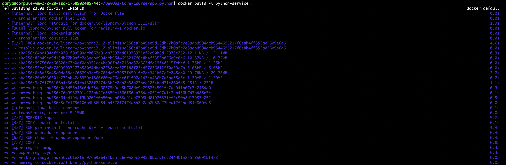
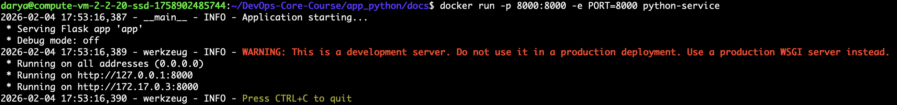
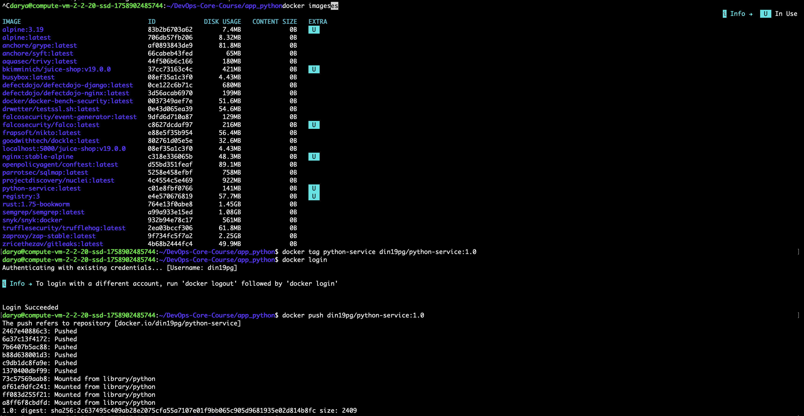

# LAB02 — Dockerizing a Python Application

## Docker Best Practices Applied

### 🔹 Non-root user
**Practice:** The container runs the application as a non-root user.

**Why it matters:**
Running containers as root increases security risks. If an attacker exploits the application,
they may gain elevated privileges inside the container. Using a non-root user limits the
potential impact of security vulnerabilities.

**Implementation:**
```
RUN useradd -m appuser
RUN chown -R appuser:appuser /app
USER appuser
```

### 🔹 Layer caching for dependencies
**Practice:** Dependencies are installed before copying application source code.

**Why it matters:**  
Docker caches layers during image builds. By copying `requirements.txt` and installing
dependencies first, Docker can reuse the cached layer when application code changes,
significantly speeding up rebuilds.

**Implementation:**
```
COPY requirements.txt .
RUN pip install --no-cache-dir -r requirements.txt
```

### 🔹 `.dockerignore`
**Practice:** A `.dockerignore` file is used to exclude unnecessary files.

**Why it matters:**  
Excluding files such as virtual environments, Git metadata, and cache files reduces
the build context size, speeds up the build process, and results in smaller images.

### 🔹 Specific base image version
**Practice:** A specific Python image version is used instead of `latest`.

**Why it matters:**  
Pinning the base image version ensures reproducible builds and prevents unexpected
breaking changes caused by upstream updates.
---
## Image Information & Decisions

### Base image choice
The image is based on `python:3.12-slim`.

This version was chosen because:
- It provides a stable and modern Python version
- The slim variant significantly reduces image size
- It avoids compatibility issues often encountered with Alpine images

### Image size
The final image size is approximately 141MB.

This size is reasonable for a Python service and reflects the use of a slim base image
and exclusion of unnecessary build artifacts.

### Layer structure
The Dockerfile is structured to maximize cache efficiency:
1. Base image selection
2. Dependency installation
3. User creation and permission setup
4. Application source code copy
5. Application startup command

---
## Build & Run Process





https://hub.docker.com/repository/docker/din19pg/python-service/general
---

## Technical Analysis

### 🔹 Why does this Dockerfile work?
The Dockerfile correctly defines all required steps to build and run the application,
including dependency installation, security configuration, and runtime execution.
Each instruction builds upon the previous layer in a predictable and reproducible way.

### 🔹 What if layer order changed?
If application source code were copied before installing dependencies, Docker would
invalidate the cache on every code change, resulting in slower rebuild times.

### 🔹 Security considerations
Security was improved by running the application as a non-root user and minimizing
the attack surface using a slim base image.

### 🔹 Role of `.dockerignore`
The `.dockerignore` file prevents unnecessary files from being sent to the Docker daemon,
which reduces build time and avoids leaking development artifacts into the image.

---
## Challenges & Solutions

One challenge encountered was an incorrect build context path, which caused Docker
to fail with a "path not found" error. This was resolved by verifying the project
directory structure and running the build command from the correct location.

Through this process, I gained a deeper understanding of Docker image layering,
build contexts, and container security best practices.

