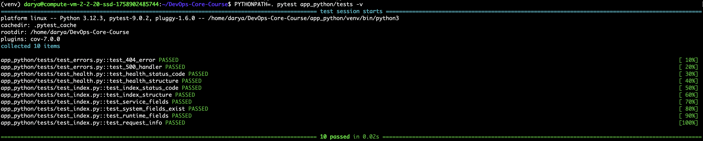
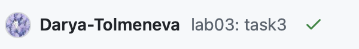
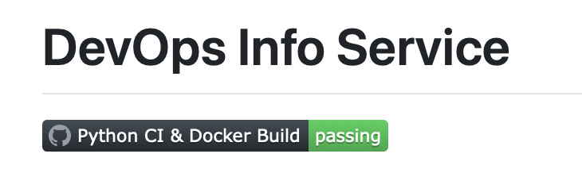

# LAB03 - Continuous Integration (CI/CD)

## Testing Framework Choice

**Framework:** `pytest`

**Why pytest:**

- Clean and readable syntax, making it easy to write tests for Flask
    
- Supports fixtures for reusable test clients
    
- Allows testing HTTP endpoints without starting the server
    
- Well-suited for modern Python projects and internship-level tasks
    
- Widely adopted and easily integrates with CI/CD
    

> Compared to `unittest`, pytest is more modern and convenient, especially for REST API testing.

---

## Test Structure

```
app_python/
├── app.py
├── tests/
│   ├── conftest.py        # fixture for Flask test client
│   ├── test_index.py      # tests for GET /
│   ├── test_health.py     # tests for GET /health
│   └── test_errors.py     # tests for error handling (404, 500)
```

**Details:**

- `conftest.py` contains the `client` fixture, which creates a Flask test client with `TESTING=True` and `PROPAGATE_EXCEPTIONS=False`
    
- `test_index.py` verifies:
    
    - HTTP status code = 200
        
    - JSON structure (fields `service`, `system`, `runtime`, `request`, `endpoints`)
        
    - Data types and specific values where necessary
        
- `test_health.py` verifies:
    
    - Response status and JSON structure (`status`, `timestamp`, `uptime_seconds`)
        
- `test_errors.py` verifies:
    
    - 404 Not Found for non-existing endpoints
        
    - 500 Internal Server Error using monkeypatching to test the exception handler
        

---

## How to Run Tests Locally

1. Activate the virtual environment:
    

```bash
source app_python/venv/bin/activate
```

2. Install development dependencies:
    

```bash
pip install -r requirements-dev.txt
```

3. Run tests:
    

```bash
PYTHONPATH=. pytest app_python/tests -v
```

4. Run tests with coverage:
    

```bash
PYTHONPATH=. pytest --cov=app_python --cov-report=term-missing
```

---

## Terminal Output 



## GitHub Actions CI Workflow

**Workflow Trigger Strategy**  
The workflow is triggered on `push` and `pull_request` events for the `master` and `lab03` branches.

- **Reasoning:** This ensures that all code changes are automatically tested and linted before merging into the main branch.
    
- It also allows automatic Docker image builds for every commit pushed to these branches, keeping our container images up-to-date.
    

**Chosen Actions from Marketplace**

- `actions/checkout@v4` — to fetch the repository code.
    
- `actions/setup-python@v5` — to set up the correct Python version (3.12) for testing and linting.
    
- `docker/login-action@v2` — to securely authenticate to Docker Hub using GitHub Secrets.
    
- `docker/build-push-action@v6` — to build and push Docker images with multiple tags.
    
- **Reasoning:** These actions are official, widely used, and simplify CI tasks without writing complex shell scripts.
    

**Docker Tagging Strategy**

- We use **Calendar Versioning (CalVer)** with the format `YYYY.MM.DD` (e.g., `2026.02.11`).
    
- Docker images are pushed with two tags:
    
    - `din19pg/python-service:2026.02.11` — fixed version for reproducibility.
        
    - `din19pg/python-service:latest` — always points to the most recent image.
        
- **Reasoning:** This strategy provides both a stable, timestamped version and an always-current version for easy deployment.

[Link](https://github.com/Darya-Tolmeneva/DevOps-Core-Course/actions/runs/21921482124)





## CI Workflow Optimization & Security

### Status Badge


- Added a GitHub Actions status badge to the `app_python/README.md`:
    
- **Reasoning:** This provides immediate visual feedback on the workflow status (passing/failing) and allows developers and reviewers to quickly see if the build is healthy.
    

---
### CI Best Practices Applied

1. **Fail Fast** — the workflow stops immediately if tests or linters fail, preventing wasted time building Docker images on broken code.
    
2. **Job Dependencies** — Docker build & push job runs only if the testing job passes successfully.
    
3. **Secrets Usage** — Docker Hub credentials and Snyk token are stored in GitHub Secrets to ensure security.
    

- **Reasoning:** These practices improve efficiency, maintain security, and ensure reliable builds.
    

---

### Snyk Security Scanning

- Integrated Snyk into the CI workflow:

- **Severity Threshold:** `high` — the workflow fails only if high or critical vulnerabilities are detected.
    
- **Result:**
    
    - No high or critical vulnerabilities found in our dependencies.
        
    - Low/medium issues are logged as warnings for awareness but do not block the build.
        
- **Reasoning:** Prevents introducing serious vulnerabilities without unnecessarily blocking development for minor issues.
    
