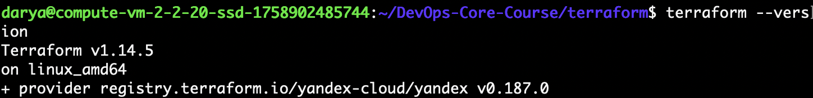
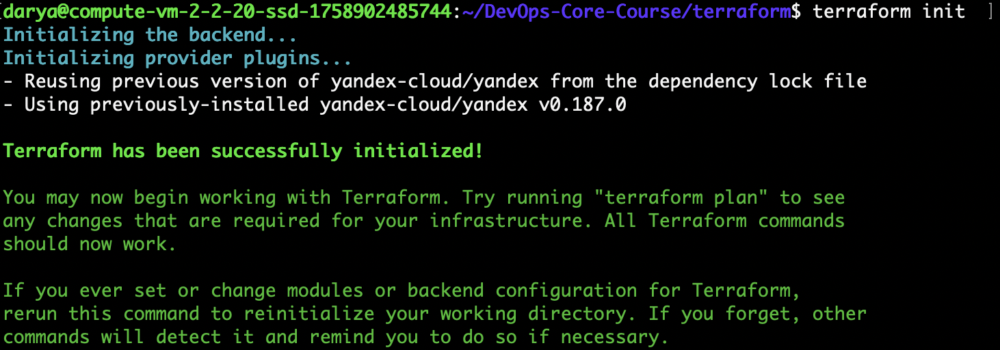
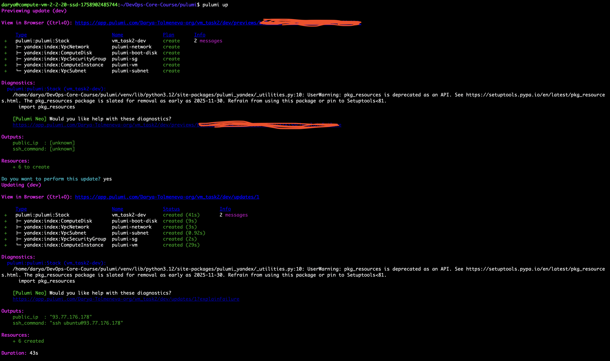

# 1. Cloud Provider & Infrastructure

## Cloud Provider and Rationale

For this task, I selected **Yandex Cloud** as the cloud provider.

The main reasons for this choice were:

* Availability of a free tier suitable for small virtual machines
* Native Terraform provider (`yandex-cloud/yandex`)
* Simple IAM and service account integration
* Good documentation and clear networking model

Since the goal was to deploy a lightweight VM for infrastructure practice, Yandex Cloud provided an optimal balance between simplicity and functionality.

---

## Instance Type and Size

The virtual machine was created using the following configuration:

* Platform: `standard-v2`
* vCPUs: 2 cores
* Core fraction: 20%
* RAM: 1 GB
* Boot disk: 10 GB HDD

This configuration corresponds to the smallest free-tier-compatible instance and is sufficient for:

* SSH access
* Basic server setup
* Future deployment of a lightweight backend application (e.g., on port 5000)

---

## Region / Zone Selected

The VM was deployed in:

* Region: `ru-central1`
* Zone: `ru-central1-a`

This zone was selected as the default and recommended zone for Yandex Cloud resources.

---

## Total Cost

The estimated cost for the deployed resources in Yandex Cloud is **1,241.62 RUB**, broken down as follows:

| Resource                                           | Amount (RUB) | Notes                                                      |
| -------------------------------------------------- | ------------ | ---------------------------------------------------------- |
| Compute resources – vCPU (Intel Cascade Lake, 20%) | 774.75       | For the small VM (standard-v2, 2 cores, 20% core fraction) |
| Compute resources – RAM                            | 245.07       | 1 GB memory allocated for the VM                           |
| Public IP (dynamic or static)                      | 189.73       | External IP for SSH and HTTP access                        |
| Standard disk (HDD)                                | 32.06        | 10 GB boot disk                                            |

**Notes:**

* The VM configuration was chosen to match the free-tier eligible instance type (`standard-v2`) with minimal resources.
* The cost includes a breakdown of compute, memory, network, and storage.
* No paid add-ons, premium disks, or high-availability features were used.

---

## Resources Created

The following resources were provisioned using Terraform:

* Virtual Machine (`yandex_compute_instance`)
* VPC Network (or reused existing default network)
* Subnet within VPC
* Security Group with:

  * SSH access (port 22, restricted to my IP)
  * HTTP access (port 80)
  * Custom port 5000 (future app deployment)
* Public IP (via NAT in network interface)

---

# 2. Terraform Implementation

## Terraform Version Used

Terraform CLI version:



---

## Project Structure

The project follows a modular and maintainable structure:

```
terraform/
├── main.tf           # Provider and resource definitions
├── variables.tf      # Input variables
├── outputs.tf        # Output values (public IP, SSH command)
├── terraform.tfvars  # Variable values (gitignored)
├── .gitignore        # Prevent committing sensitive files
└── README.md         # Documentation
```

Key design decisions:

* Sensitive data is excluded from version control
* Variables are used for configurable values (zone, IP, image ID)
* Outputs expose important connection information
* SSH public key is referenced securely

---

## Key Configuration Decisions

* Used variables for region, SSH IP restriction, and image ID to improve reusability
* Opened only required ports (22, 80, 5000)
* Used labels for resource identification
* Ensured Terraform state file is not committed to Git

---

## Challenges Encountered

During implementation, several issues were encountered:

1. **SSH key file path issue**

   * Terraform does not expand `~`
   * Solution: Use absolute path or copy key into project directory

2. **Quota limit exceeded**

   * Error: `Quota limit vpc.networks.count exceeded`
   * Solution: Removed ild unnecessary VPC network

3. **CIDR formatting issue**

   * Error: Prefix length required
   * Solution: Specify IP in CIDR format (`X.X.X.X/32`)

These issues helped deepen understanding of:

* Terraform file resolution
* Cloud provider quotas
* Networking and security group configuration

---

## Terminal Output

### terraform init


---

### terraform plan (sanitized)

```
terraform plan

Terraform used the selected providers to generate the following execution plan. Resource
actions are indicated with the following symbols:
  + create

Terraform will perform the following actions:

  # yandex_compute_instance.vm will be created
  + resource "yandex_compute_instance" "vm" {
      + created_at                = (known after apply)
      + folder_id                 = (known after apply)
      + fqdn                      = (known after apply)
      + gpu_cluster_id            = (known after apply)
      + hardware_generation       = (known after apply)
      + hostname                  = (known after apply)
      + id                        = (known after apply)
      + labels                    = {
          + "environment" = "terraform"
          + "project"     = "vm-task"
        }
      + maintenance_grace_period  = (known after apply)
      + maintenance_policy        = (known after apply)
      + metadata                  = {
          + "ssh-keys" = <<-EOT
                ubuntu:ssh-ed25519 **** tolmeneva05@mail.ru
            EOT
        }
      + name                      = "terraform-vm"
      + network_acceleration_type = "standard"
      + platform_id               = "standard-v2"
      + status                    = (known after apply)
      + zone                      = (known after apply)

      + boot_disk {
          + auto_delete = true
          + device_name = (known after apply)
          + disk_id     = (known after apply)
          + mode        = (known after apply)

          + initialize_params {
              + block_size  = (known after apply)
              + description = (known after apply)
              + image_id    = "fd8q1krrgc5pncjckeht"
              + name        = (known after apply)
              + size        = 10
              + snapshot_id = (known after apply)
              + type        = "network-hdd"
            }
        }

      + metadata_options (known after apply)

      + network_interface {
          + index              = (known after apply)
          + ip_address         = (known after apply)
          + ipv4               = true
          + ipv6               = (known after apply)
          + ipv6_address       = (known after apply)
          + mac_address        = (known after apply)
          + nat                = true
          + nat_ip_address     = (known after apply)
          + nat_ip_version     = (known after apply)
          + security_group_ids = (known after apply)
          + subnet_id          = (known after apply)
        }

      + placement_policy (known after apply)

      + resources {
          + core_fraction = 20
          + cores         = 2
          + memory        = 1
        }

      + scheduling_policy (known after apply)
    }

  # yandex_vpc_network.network will be created
  + resource "yandex_vpc_network" "network" {
      + created_at                = (known after apply)
      + default_security_group_id = (known after apply)
      + folder_id                 = (known after apply)
      + id                        = (known after apply)
      + labels                    = (known after apply)
      + name                      = "terraform-network"
      + subnet_ids                = (known after apply)
    }

  # yandex_vpc_security_group.vm_sg will be created
  + resource "yandex_vpc_security_group" "vm_sg" {
      + created_at = (known after apply)
      + folder_id  = (known after apply)
      + id         = (known after apply)
      + labels     = (known after apply)
      + name       = "terraform-sg"
      + network_id = (known after apply)
      + status     = (known after apply)

      + egress {
          + from_port         = -1
          + id                = (known after apply)
          + labels            = (known after apply)
          + port              = -1
          + protocol          = "ANY"
          + to_port           = -1
          + v4_cidr_blocks    = [
              + "0.0.0.0/0",
            ]
          + v6_cidr_blocks    = []
            # (3 unchanged attributes hidden)
        }

      + ingress {
          + from_port         = -1
          + id                = (known after apply)
          + labels            = (known after apply)
          + port              = 22
          + protocol          = "TCP"
          + to_port           = -1
          + v4_cidr_blocks    = [
              + "51.***.***.212",
            ]
          + v6_cidr_blocks    = []
            # (3 unchanged attributes hidden)
        }
      + ingress {
          + from_port         = -1
          + id                = (known after apply)
          + labels            = (known after apply)
          + port              = 5000
          + protocol          = "TCP"
          + to_port           = -1
          + v4_cidr_blocks    = [
              + "0.0.0.0/0",
            ]
          + v6_cidr_blocks    = []
            # (3 unchanged attributes hidden)
        }
      + ingress {
          + from_port         = -1
          + id                = (known after apply)
          + labels            = (known after apply)
          + port              = 80
          + protocol          = "TCP"
          + to_port           = -1
          + v4_cidr_blocks    = [
              + "0.0.0.0/0",
            ]
          + v6_cidr_blocks    = []
            # (3 unchanged attributes hidden)
        }
    }

  # yandex_vpc_subnet.subnet will be created
  + resource "yandex_vpc_subnet" "subnet" {
      + created_at     = (known after apply)
      + folder_id      = (known after apply)
      + id             = (known after apply)
      + labels         = (known after apply)
      + name           = "terraform-subnet"
      + network_id     = (known after apply)
      + v4_cidr_blocks = [
          + "10.5.0.0/24",
        ]
      + v6_cidr_blocks = (known after apply)
      + zone           = "ru-central1-a"
    }

Plan: 4 to add, 0 to change, 0 to destroy.

Changes to Outputs:
  + public_ip   = (known after apply)
  + ssh_command = (known after apply)

─────────────────────────────────────────────────────────────────────────────────────────

Note: You didn't use the -out option to save this plan, so Terraform can't guarantee to
take exactly these actions if you run "terraform apply" now.
```

---

### terraform apply

```
terraform apply
yandex_vpc_network.network: Refreshing state... [id=***]
yandex_vpc_subnet.subnet: Refreshing state... [id=***]

Terraform used the selected providers to generate the following execution plan. Resource
actions are indicated with the following symbols:
  + create

Terraform will perform the following actions:

  # yandex_compute_instance.vm will be created
  + resource "yandex_compute_instance" "vm" {
      + created_at                = (known after apply)
      + folder_id                 = (known after apply)
      + fqdn                      = (known after apply)
      + gpu_cluster_id            = (known after apply)
      + hardware_generation       = (known after apply)
      + hostname                  = (known after apply)
      + id                        = (known after apply)
      + labels                    = {
          + "environment" = "terraform"
          + "project"     = "vm-task"
        }
      + maintenance_grace_period  = (known after apply)
      + maintenance_policy        = (known after apply)
      + metadata                  = {
          + "ssh-keys" = <<-EOT
                ubuntu:ssh-ed25519 *** tolmeneva05@mail.ru
            EOT
        }
      + name                      = "terraform-vm"
      + network_acceleration_type = "standard"
      + platform_id               = "standard-v2"
      + status                    = (known after apply)
      + zone                      = (known after apply)

      + boot_disk {
          + auto_delete = true
          + device_name = (known after apply)
          + disk_id     = (known after apply)
          + mode        = (known after apply)

          + initialize_params {
              + block_size  = (known after apply)
              + description = (known after apply)
              + image_id    = "fd8q1krrgc5pncjckeht"
              + name        = (known after apply)
              + size        = 10
              + snapshot_id = (known after apply)
              + type        = "network-hdd"
            }
        }

      + metadata_options (known after apply)

      + network_interface {
          + index              = (known after apply)
          + ip_address         = (known after apply)
          + ipv4               = true
          + ipv6               = (known after apply)
          + ipv6_address       = (known after apply)
          + mac_address        = (known after apply)
          + nat                = true
          + nat_ip_address     = (known after apply)
          + nat_ip_version     = (known after apply)
          + security_group_ids = (known after apply)
          + subnet_id          = "***"
        }

      + placement_policy (known after apply)

      + resources {
          + core_fraction = 20
          + cores         = 2
          + memory        = 1
        }

      + scheduling_policy (known after apply)
    }

  # yandex_vpc_security_group.vm_sg will be created
  + resource "yandex_vpc_security_group" "vm_sg" {
      + created_at = (known after apply)
      + folder_id  = (known after apply)
      + id         = (known after apply)
      + labels     = (known after apply)
      + name       = "terraform-sg"
      + network_id = "***"
      + status     = (known after apply)

      + egress {
          + from_port         = -1
          + id                = (known after apply)
          + labels            = (known after apply)
          + port              = -1
          + protocol          = "ANY"
          + to_port           = -1
          + v4_cidr_blocks    = [
              + "0.0.0.0/0",
            ]
          + v6_cidr_blocks    = []
            # (3 unchanged attributes hidden)
        }

      + ingress {
          + from_port         = -1
          + id                = (known after apply)
          + labels            = (known after apply)
          + port              = 22
          + protocol          = "TCP"
          + to_port           = -1
          + v4_cidr_blocks    = [
              + "51.***.***.212/32",
            ]
          + v6_cidr_blocks    = []
            # (3 unchanged attributes hidden)
        }
      + ingress {
          + from_port         = -1
          + id                = (known after apply)
          + labels            = (known after apply)
          + port              = 5000
          + protocol          = "TCP"
          + to_port           = -1
          + v4_cidr_blocks    = [
              + "0.0.0.0/0",
            ]
          + v6_cidr_blocks    = []
            # (3 unchanged attributes hidden)
        }
      + ingress {
          + from_port         = -1
          + id                = (known after apply)
          + labels            = (known after apply)
          + port              = 80
          + protocol          = "TCP"
          + to_port           = -1
          + v4_cidr_blocks    = [
              + "0.0.0.0/0",
            ]
          + v6_cidr_blocks    = []
            # (3 unchanged attributes hidden)
        }
    }

Plan: 2 to add, 0 to change, 0 to destroy.

Changes to Outputs:
  + public_ip   = (known after apply)
  + ssh_command = (known after apply)

Do you want to perform these actions?
  Terraform will perform the actions described above.
  Only 'yes' will be accepted to approve.

  Enter a value: yes

yandex_vpc_security_group.vm_sg: Creating...
yandex_vpc_security_group.vm_sg: Creation complete after 2s [id=***]
yandex_compute_instance.vm: Creating...
yandex_compute_instance.vm: Still creating... [00m10s elapsed]
yandex_compute_instance.vm: Still creating... [00m20s elapsed]
yandex_compute_instance.vm: Still creating... [00m30s elapsed]
yandex_compute_instance.vm: Still creating... [00m40s elapsed]
yandex_compute_instance.vm: Creation complete after 44s [id=***]

Apply complete! Resources: 2 added, 0 changed, 0 destroyed.

Outputs:

public_ip = "93.77.177.69"
ssh_command = "ssh ubuntu@93.77.177.69"
```

### terraform destroy
```
terraform destroy
yandex_vpc_network.network: Refreshing state... [id=***]
yandex_vpc_subnet.subnet: Refreshing state... [id=***]
yandex_vpc_security_group.vm_sg: Refreshing state... [id=***]
yandex_compute_instance.vm: Refreshing state... [id=***]

Terraform used the selected providers to generate the following execution plan. Resource
actions are indicated with the following symbols:
  - destroy

Terraform will perform the following actions:

  # yandex_compute_instance.vm will be destroyed
  - resource "yandex_compute_instance" "vm" {
      - created_at                = "2026-02-18T20:16:43Z" -> null
      - folder_id                 = "***" -> null
      - fqdn                      = "***.auto.internal" -> null
      - hardware_generation       = [
          - {
              - generation2_features = []
              - legacy_features      = [
                  - {
                      - pci_topology = "PCI_TOPOLOGY_V2"
                    },
                ]
            },
        ] -> null
      - id                        = "***" -> null
      - labels                    = {
          - "environment" = "terraform"
          - "project"     = "vm-task"
        } -> null
      - metadata                  = {
          - "ssh-keys" = <<-EOT
                ubuntu:ssh-ed25519 ****/**** tolmeneva05@mail.ru
            EOT
        } -> null
      - name                      = "terraform-vm" -> null
      - network_acceleration_type = "standard" -> null
      - platform_id               = "standard-v2" -> null
      - status                    = "running" -> null
      - zone                      = "ru-central1-a" -> null
        # (5 unchanged attributes hidden)

      - boot_disk {
          - auto_delete = true -> null
          - device_name = "***" -> null
          - disk_id     = "***" -> null
          - mode        = "READ_WRITE" -> null

          - initialize_params {
              - block_size  = 4096 -> null
              - image_id    = "fd8q1krrgc5pncjckeht" -> null
                name        = null
              - size        = 10 -> null
              - type        = "network-hdd" -> null
                # (3 unchanged attributes hidden)
            }
        }

      - metadata_options {
          - aws_v1_http_endpoint = 1 -> null
          - aws_v1_http_token    = 2 -> null
          - gce_http_endpoint    = 1 -> null
          - gce_http_token       = 1 -> null
        }

      - network_interface {
          - index              = 0 -> null
          - ip_address         = "10.5.0.3" -> null
          - ipv4               = true -> null
          - ipv6               = false -> null
          - mac_address        = "d0:0d:3f:af:1c:33" -> null
          - nat                = true -> null
          - nat_ip_address     = "93.77.177.69" -> null
          - nat_ip_version     = "IPV4" -> null
          - security_group_ids = [
              - "***",
            ] -> null
          - subnet_id          = "***" -> null
            # (1 unchanged attribute hidden)
        }

      - placement_policy {
          - host_affinity_rules       = [] -> null
          - placement_group_partition = 0 -> null
            # (1 unchanged attribute hidden)
        }

      - resources {
          - core_fraction = 20 -> null
          - cores         = 2 -> null
          - gpus          = 0 -> null
          - memory        = 1 -> null
        }

      - scheduling_policy {
          - preemptible = false -> null
        }
    }

  # yandex_vpc_network.network will be destroyed
  - resource "yandex_vpc_network" "network" {
      - created_at                = "2026-02-18T20:15:38Z" -> null
      - default_security_group_id = "***" -> null
      - folder_id                 = "***" -> null
      - id                        = "***" -> null
      - labels                    = {} -> null
      - name                      = "terraform-network" -> null
      - subnet_ids                = [
          - "***",
        ] -> null
        # (1 unchanged attribute hidden)
    }

  # yandex_vpc_security_group.vm_sg will be destroyed
  - resource "yandex_vpc_security_group" "vm_sg" {
      - created_at  = "2026-02-18T20:16:42Z" -> null
      - folder_id   = "***" -> null
      - id          = "***" -> null
      - labels      = {} -> null
      - name        = "terraform-sg" -> null
      - network_id  = "***" -> null
      - status      = "ACTIVE" -> null
        # (1 unchanged attribute hidden)

      - egress {
          - from_port         = -1 -> null
          - id                = "***" -> null
          - labels            = {} -> null
          - port              = -1 -> null
          - protocol          = "ANY" -> null
          - to_port           = -1 -> null
          - v4_cidr_blocks    = [
              - "0.0.0.0/0",
            ] -> null
          - v6_cidr_blocks    = [] -> null
            # (3 unchanged attributes hidden)
        }

      - ingress {
          - from_port         = -1 -> null
          - id                = "***" -> null
          - labels            = {} -> null
          - port              = 22 -> null
          - protocol          = "TCP" -> null
          - to_port           = -1 -> null
          - v4_cidr_blocks    = [
              - "51.***.***.212/32",
            ] -> null
          - v6_cidr_blocks    = [] -> null
            # (3 unchanged attributes hidden)
        }
      - ingress {
          - from_port         = -1 -> null
          - id                = "***" -> null
          - labels            = {} -> null
          - port              = 80 -> null
          - protocol          = "TCP" -> null
          - to_port           = -1 -> null
          - v4_cidr_blocks    = [
              - "0.0.0.0/0",
            ] -> null
          - v6_cidr_blocks    = [] -> null
            # (3 unchanged attributes hidden)
        }
      - ingress {
          - from_port         = -1 -> null
          - id                = "***" -> null
          - labels            = {} -> null
          - port              = 5000 -> null
          - protocol          = "TCP" -> null
          - to_port           = -1 -> null
          - v4_cidr_blocks    = [
              - "0.0.0.0/0",
            ] -> null
          - v6_cidr_blocks    = [] -> null
            # (3 unchanged attributes hidden)
        }
    }

  # yandex_vpc_subnet.subnet will be destroyed
  - resource "yandex_vpc_subnet" "subnet" {
      - created_at     = "2026-02-18T20:15:40Z" -> null
      - folder_id      = "***" -> null
      - id             = "***" -> null
      - labels         = {} -> null
      - name           = "terraform-subnet" -> null
      - network_id     = "***" -> null
      - v4_cidr_blocks = [
          - "10.5.0.0/24",
        ] -> null
      - v6_cidr_blocks = [] -> null
      - zone           = "ru-central1-a" -> null
        # (2 unchanged attributes hidden)
    }

Plan: 0 to add, 0 to change, 4 to destroy.

Changes to Outputs:
  - public_ip   = "93.77.177.69" -> null
  - ssh_command = "ssh ubuntu@93.77.177.69" -> null

Do you really want to destroy all resources?
  Terraform will destroy all your managed infrastructure, as shown above.
  There is no undo. Only 'yes' will be accepted to confirm.

  Enter a value: yes

yandex_compute_instance.vm: Destroying... [id=***]
yandex_compute_instance.vm: Still destroying... [id=***, 00m10s elapsed]
yandex_compute_instance.vm: Still destroying... [id=***, 00m20s elapsed]
yandex_compute_instance.vm: Still destroying... [id=***, 00m30s elapsed]
yandex_compute_instance.vm: Still destroying... [id=***, 00m40s elapsed]
yandex_compute_instance.vm: Still destroying... [id=***, 00m50s elapsed]
yandex_compute_instance.vm: Destruction complete after 58s
yandex_vpc_subnet.subnet: Destroying... [id=***]
yandex_vpc_security_group.vm_sg: Destroying... [id=***]
yandex_vpc_security_group.vm_sg: Destruction complete after 1s
yandex_vpc_subnet.subnet: Destruction complete after 6s
yandex_vpc_network.network: Destroying... [id=***]
yandex_vpc_network.network: Destruction complete after 1s

Destroy complete! Resources: 4 destroyed.
```
---

# 3. Pulumi Implementation

* **Pulumi Version & Language Used:** Pulumi CLI v3.x, Python 3.12
* **How Code Differs from Terraform:**

  * Pulumi uses a **real programming language (Python)** instead of declarative HCL.
  * Resources are instantiated as **classes with arguments**, rather than `resource "type" "name" { ... }`.
  * Variables are retrieved via `pulumi.Config()` instead of `variables.tf`/`terraform.tfvars`.
  * Outputs are defined using `pulumi.export()` and support `.apply()` for dynamic values.
* **Advantages Discovered:**

  * Easier code reuse and modularization.
  * Better integration with IDEs (type checking, autocompletion).
* **Challenges Encountered:**

  * Initial confusion with Pulumi Yandex SDK imports (`compute` and `vpc` no longer exist as submodules).
  * Required creating boot disk as a separate resource (`ComputeDisk`) instead of using `initialize_params`.
  * Adjusting Security Group syntax to use `VpcSecurityGroupIngressArgs` / `EgressArgs`.
* **Terminal Output Examples:**
  


---

## 4. Terraform vs Pulumi Comparison

* **Ease of Learning:**

  * Terraform was easier to start with for simple infrastructure due to declarative syntax and abundant examples.
  * Pulumi required understanding Python SDK structure and Yandex resource classes, which has a steeper initial learning curve.

* **Code Readability:**

  * Terraform code is concise and readable for simple tasks.
  * Pulumi is more flexible but more verbose; readability improves with experience in Python.

* **Debugging:**

  * Terraform errors were clearer for misconfigured resources.
  * Pulumi errors sometimes involved Python exceptions or missing SDK modules, requiring more research.

* **Documentation:**

  * Terraform docs are more mature and have extensive examples.
  * Pulumi docs are improving but sometimes fragmented across languages and providers.

* **Use Case:**

  * Terraform is great for **declarative, multi-cloud infrastructure with stable state management**.
  * Pulumi is preferred when **infrastructure needs logic, or integration with code**, or when reusing existing Python/JS libraries.

---

## 5. Lab 5 Preparation & Cleanup

* **VM for Lab 5:**

  * No, the Pulumi-created VM was deleted after testing.
  * For the next lab, a **Terraform VM** will be created, as I prefer Terraform syntax and workflow.

* **Cleanup Status:**

  * All Pulumi resources (`network`, `subnet`, `security group`, `boot disk`, `vm`) were destroyed via `pulumi destroy`.
  * Example terminal output:

```bash
Previewing destroy (dev)

View in Browser (Ctrl+O): ***

     Type                              Name              Plan       
 -   pulumi:pulumi:Stack               vm_task2-dev      delete     
 -   ├─ yandex:index:ComputeInstance   pulumi-vm         delete     
 -   ├─ yandex:index:VpcSubnet         pulumi-subnet     delete     
 -   ├─ yandex:index:VpcSecurityGroup  pulumi-sg         delete     
 -   ├─ yandex:index:VpcNetwork        pulumi-network    delete     
 -   └─ yandex:index:ComputeDisk       pulumi-boot-disk  delete     

Outputs:
  - public_ip  : "93.77.176.178"
  - ssh_command: "ssh ubuntu@93.77.176.178"

Resources:
    - 6 to delete

Do you want to perform this destroy? yes
Destroying (dev)

View in Browser (Ctrl+O): ***

     Type                              Name              Status              
 -   pulumi:pulumi:Stack               vm_task2-dev      deleted (0.54s)     
 -   ├─ yandex:index:ComputeInstance   pulumi-vm         deleted (59s)       
 -   ├─ yandex:index:VpcSubnet         pulumi-subnet     deleted (6s)        
 -   ├─ yandex:index:VpcSecurityGroup  pulumi-sg         deleted (0.98s)     
 -   ├─ yandex:index:VpcNetwork        pulumi-network    deleted (0.96s)     
 -   └─ yandex:index:ComputeDisk       pulumi-boot-disk  deleted (0.62s)     

Outputs:
  - public_ip  : "93.77.176.178"
  - ssh_command: "ssh ubuntu@93.77.176.178"

Resources:
    - 6 deleted

Duration: 1m11s
```

* Cloud console confirmed **all Pulumi resources removed**.
