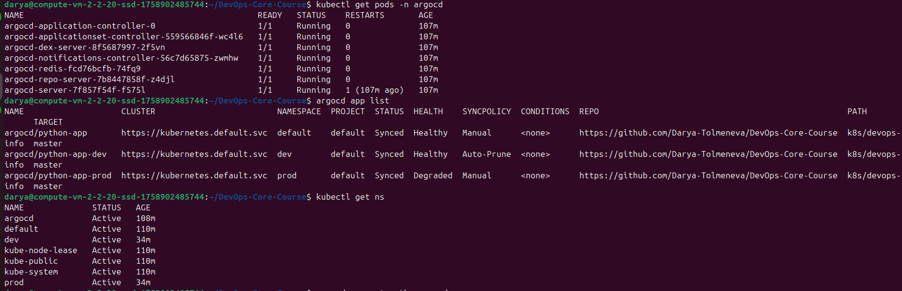
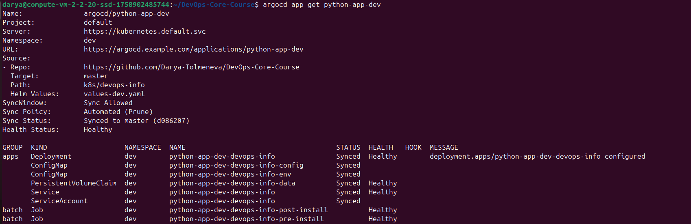
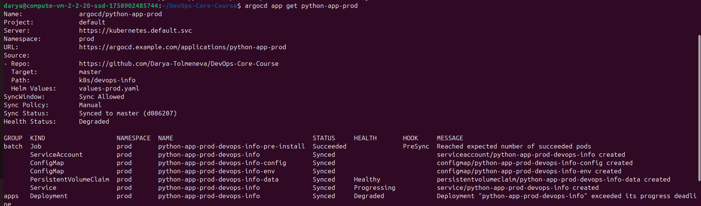
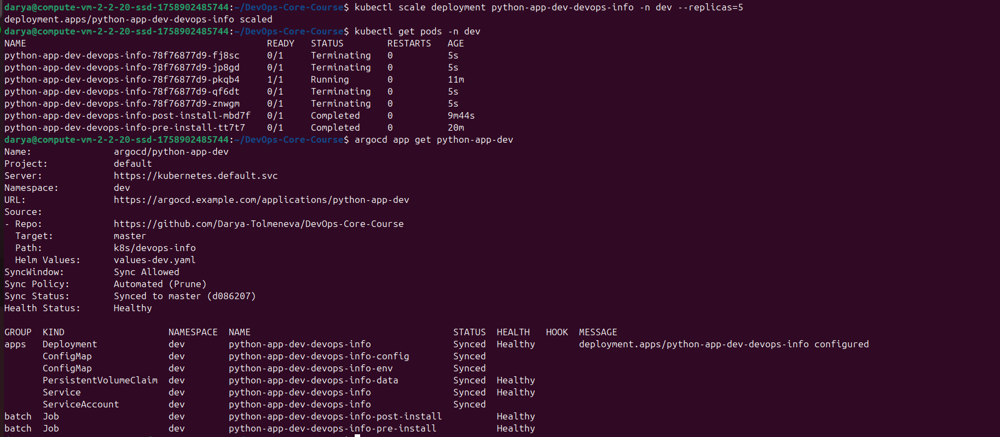

# Lab 13 — GitOps with ArgoCD

## 1. ArgoCD Installation and Setup

### Installation

ArgoCD was installed in a dedicated Kubernetes namespace using Helm:

```bash
helm repo add argo https://argoproj.github.io/argo-helm
helm repo update
kubectl create namespace argocd
helm install argocd argo/argo-cd -n argocd
```

### Access

The ArgoCD UI was accessed using port-forwarding:

```bash
kubectl port-forward svc/argocd-server -n argocd 8081:443
```

Initial admin password was retrieved via:

```bash
kubectl -n argocd get secret argocd-initial-admin-secret -o jsonpath="{.data.password}" | base64 -d
```

ArgoCD CLI was installed and configured for local access:

```bash
argocd login localhost:8081 --insecure
```

---



## 2. Application Deployment (GitOps)

### Application Definition

A Kubernetes ArgoCD Application was created pointing to a Git repository containing a Helm chart:

* Repository: GitHub repository (DevOps-Core-Course)
* Path: `k8s/devops-info`
* Target branch: `master`
* Helm values: `values.yaml`

### Deployment

The application was applied using:

```bash
kubectl apply -f k8s/argocd/application.yaml
```

The application was then synced via ArgoCD UI and CLI.

---

## 3. Multi-Environment Deployment

Two environments were implemented:

### Development Environment

* Namespace: `dev`
* Values file: `values-dev.yaml`
* Sync policy: Automated with self-healing and prune enabled
* Replicas: 1
* Logging level: DEBUG

### Production Environment

* Namespace: `prod`
* Values file: `values-prod.yaml`
* Sync policy: Manual
* Replicas: 5
* Logging level: INFO

### Key Difference

* Dev environment supports automatic reconciliation (GitOps fully automated)
* Production environment requires manual sync for controlled deployments



---

## 4. Self-Healing and Drift Detection

### Manual Drift Simulation

A manual scaling operation was performed in the dev environment:

```bash
kubectl scale deployment python-app-dev-devops-info -n dev --replicas=5
```

### Kubernetes Behavior

Kubernetes immediately created additional pods using ReplicaSet to satisfy the desired replica count at runtime.

### ArgoCD Reconciliation

Since automated sync and self-healing were enabled, ArgoCD detected the deviation between Git and cluster state and reconciled the deployment back to the desired configuration.

### Verification

```bash
argocd app get python-app-dev
```

Result:

* Sync Status: Synced
* Health Status: Healthy
* Automated sync: enabled


---

## 5. Issues Encountered and Fixes

### Missing Secret issue

Pods initially failed due to missing Kubernetes Secret:

```
Error: secret "devops-info-secret" not found
```

### Fix

The missing secret was created manually:

```bash
kubectl create secret generic devops-info-secret \
  --from-literal=APP_USERNAME=test \
  --from-literal=APP_PASSWORD=test \
  -n dev
```

After creation, pods successfully started.