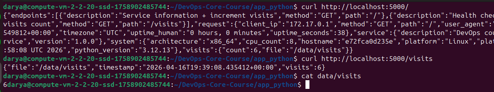
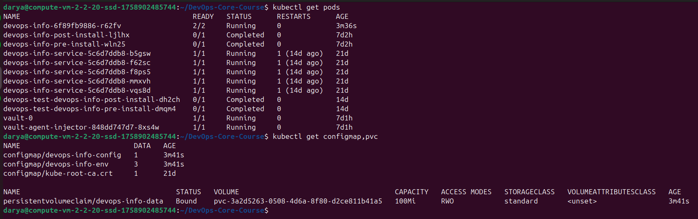
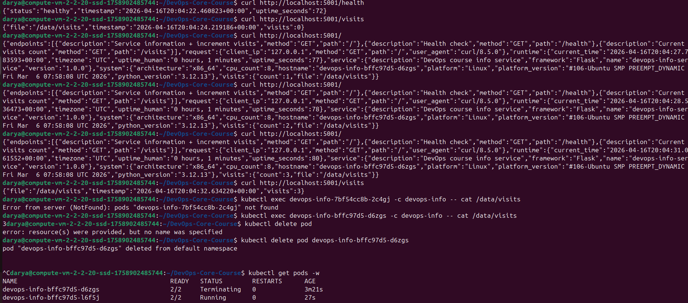
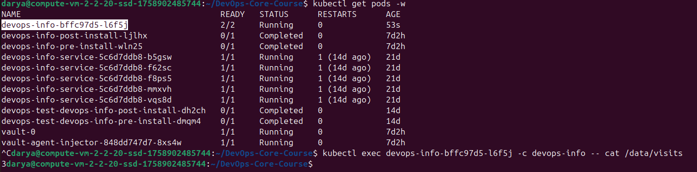

# Lab 12 — ConfigMaps & Persistent Volumes

## 1. Application Changes

The Flask application was updated to support a persistent visits counter.

### Changes made

- added a visits counter stored in `/data/visits`
- updated `GET /` to increment the counter on each request
- added `GET /visits` to return the current counter value
- on startup, the application reads the counter from the file
- if the file does not exist, the counter starts from `0`

### Example local test

```bash
curl http://localhost:5000/
curl http://localhost:5000/
curl http://localhost:5000/
curl http://localhost:5000/visits
cat data/visits
```

Result:

```text
3
```

After another request:

```text
4
```



---

## 2. ConfigMap Implementation

### File-based ConfigMap

A file `files/config.json` was added to the Helm chart.

Example content:

```json
{
  "applicationName": "devops-info-service",
  "environment": "dev",
  "features": {
    "visitsCounter": true,
    "healthEndpoint": true
  }
}
```

Template:

```yaml
apiVersion: v1
kind: ConfigMap
metadata:
  name: {{ include "devops-info.fullname" . }}-config
data:
  config.json: |-
{{ .Files.Get "files/config.json" | indent 4 }}
```

The ConfigMap was mounted into the pod at:

```text
/config/config.json
```

### Environment variable ConfigMap

A second ConfigMap was used for environment variables.

Template:

```yaml
apiVersion: v1
kind: ConfigMap
metadata:
  name: {{ include "devops-info.fullname" . }}-env
data:
  APP_ENV: {{ .Values.app.environment | quote }}
  LOG_LEVEL: {{ .Values.app.logLevel | quote }}
  DATA_DIR: {{ .Values.app.dataDir | quote }}
```

The variables were injected with:

```yaml
envFrom:
  - configMapRef:
      name: {{ include "devops-info.fullname" . }}-env
```

### Verification

```bash
kubectl get configmap,pvc
kubectl exec <pod-name> -c devops-info -- cat /config/config.json
kubectl exec <pod-name> -c devops-info -- printenv | grep APP_
kubectl exec <pod-name> -c devops-info -- printenv | grep LOG_LEVEL
kubectl exec <pod-name> -c devops-info -- printenv | grep DATA_DIR
```

Example output:

```text
APP_ENV=dev
LOG_LEVEL=DEBUG
DATA_DIR=/data
```

---

## 3. Persistent Volume

A PersistentVolumeClaim was added to store the visits counter file.

### PVC template

```yaml
apiVersion: v1
kind: PersistentVolumeClaim
metadata:
  name: {{ include "devops-info.fullname" . }}-data
spec:
  accessModes:
    - ReadWriteOnce
  resources:
    requests:
      storage: {{ .Values.persistence.size }}
  {{- if .Values.persistence.storageClass }}
  storageClassName: {{ .Values.persistence.storageClass | quote }}
  {{- end }}
```

### Values

```yaml
persistence:
  enabled: true
  size: 100Mi
  storageClass: ""
```

### Volume mount

```yaml
volumeMounts:
  - name: data-volume
    mountPath: /data
```

```yaml
volumes:
  - name: data-volume
    persistentVolumeClaim:
      claimName: {{ include "devops-info.fullname" . }}-data
```

### Verification

```bash
kubectl get configmap,pvc
kubectl exec <pod-name> -c devops-info -- cat /data/visits
```



### Persistence test

Before pod deletion:

```bash
curl http://localhost:5001/visits
kubectl exec <pod-name> -c devops-info -- cat /data/visits
```

Pod deletion:

```bash
kubectl delete pod <pod-name>
```

After new pod start:

```bash
kubectl exec <new-pod-name> -c devops-info -- cat /data/visits
curl http://localhost:5001/visits
```




The visits value remained the same after pod recreation, which confirmed persistence.

---

## 4. ConfigMap vs Secret

### ConfigMap

Used for non-sensitive configuration, for example:

- application environment
- log level
- feature flags
- JSON config files

### Secret

Used for sensitive data, for example:

- passwords
- tokens
- API keys
- credentials

### Difference

- ConfigMap stores non-sensitive configuration
- Secret stores sensitive configuration
- Secrets should not be committed to Git in plain text
