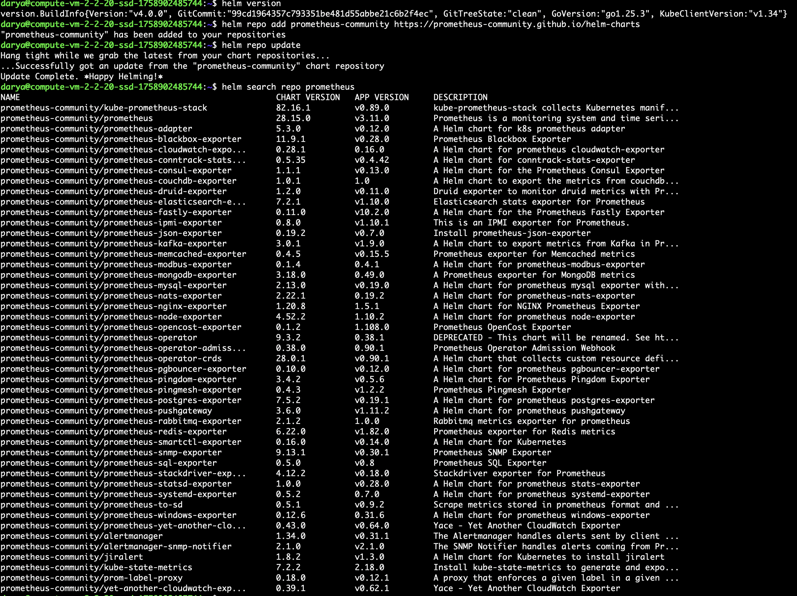
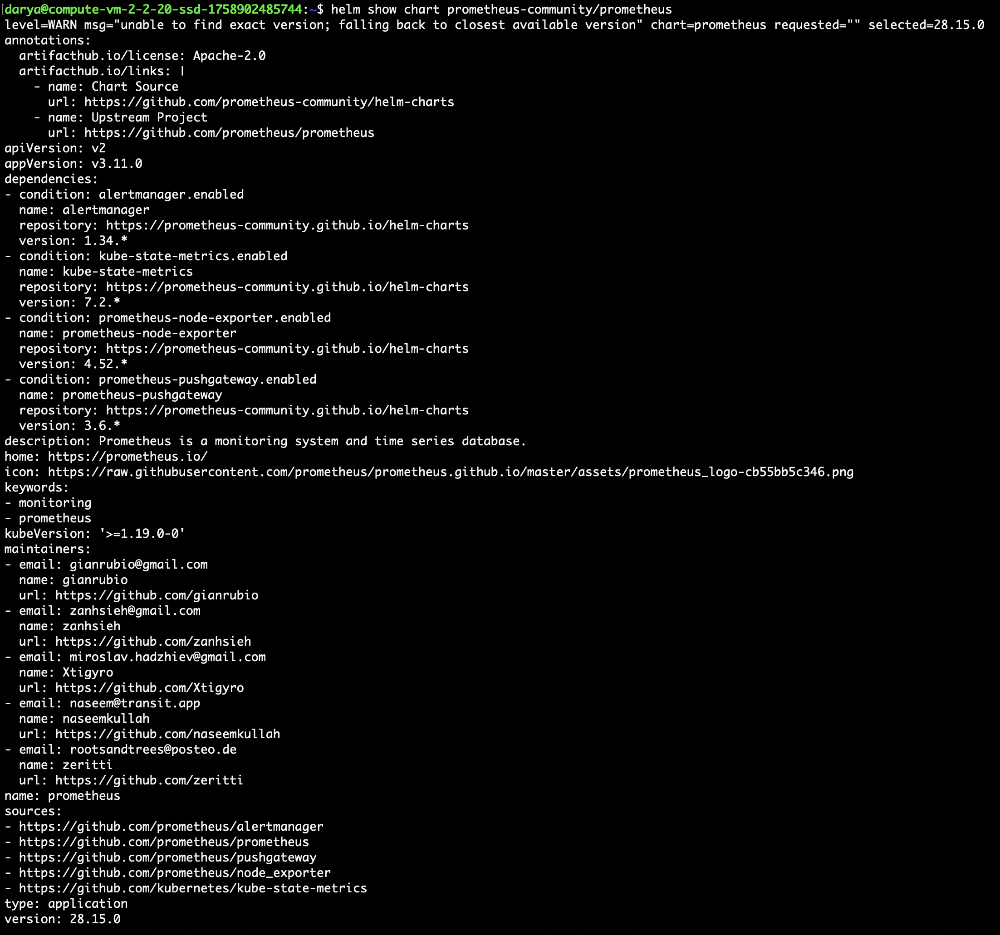
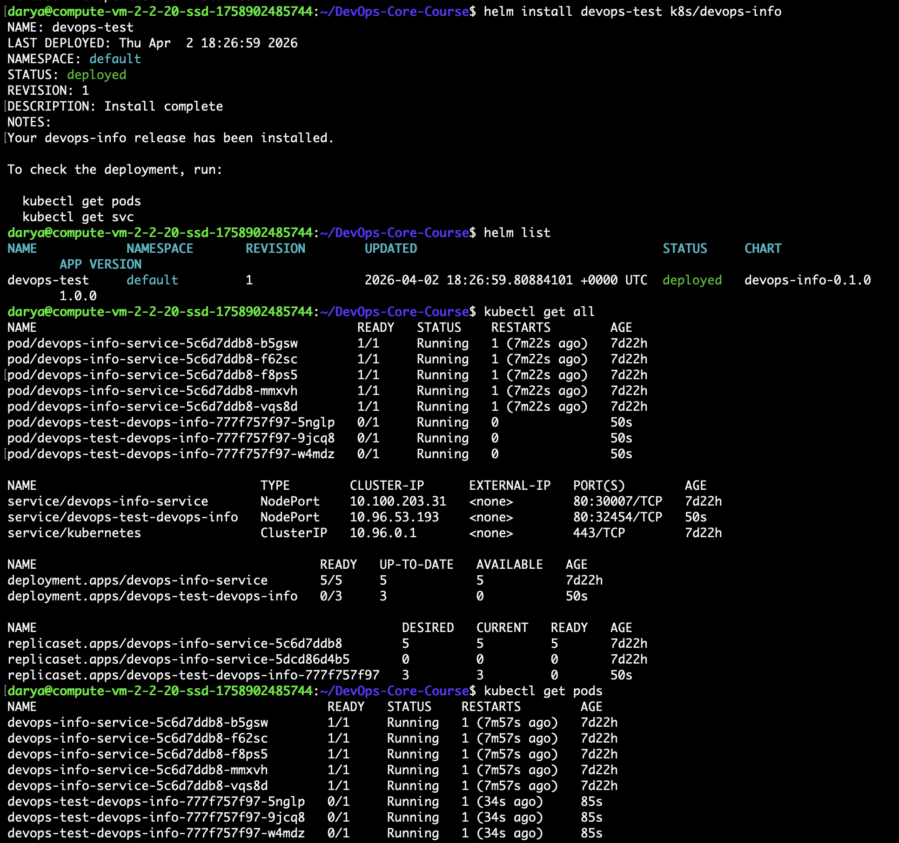
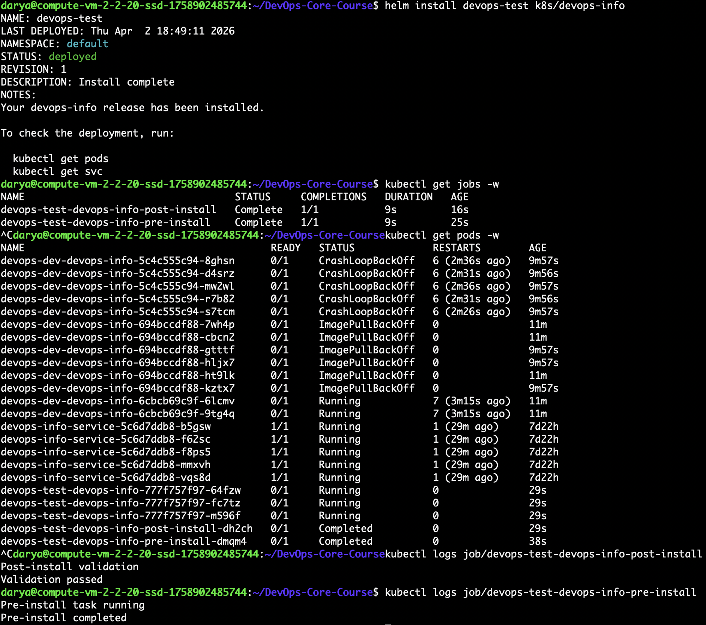
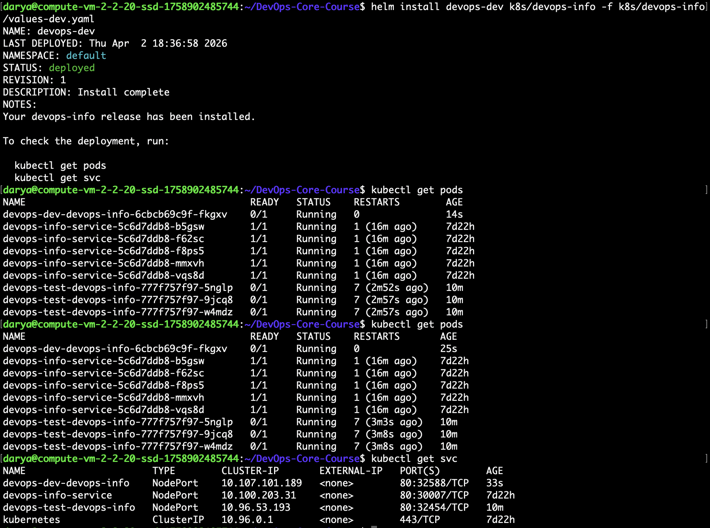
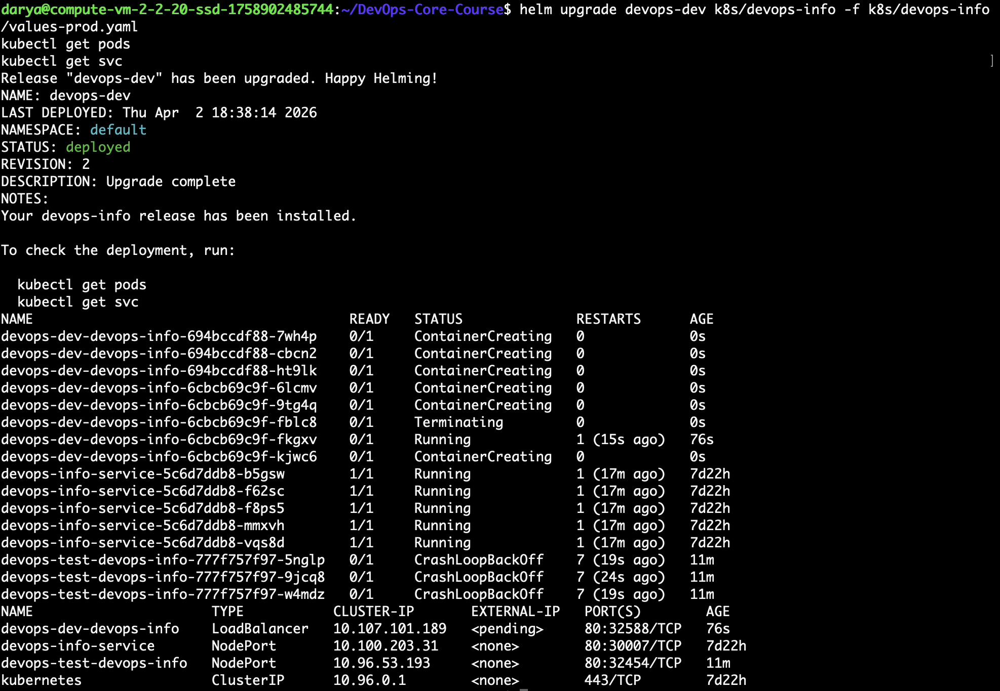
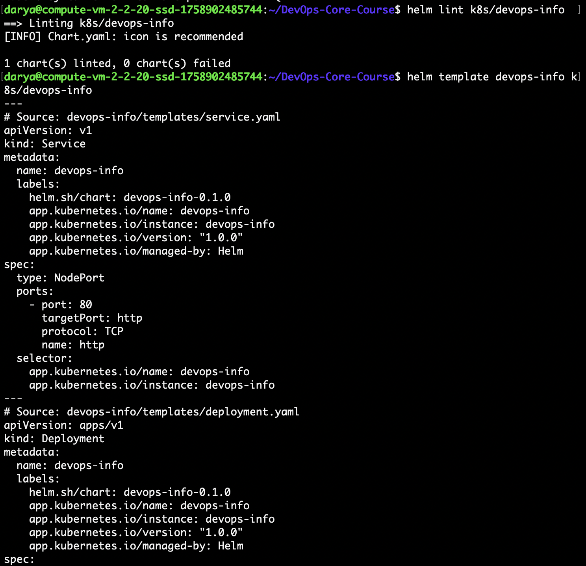
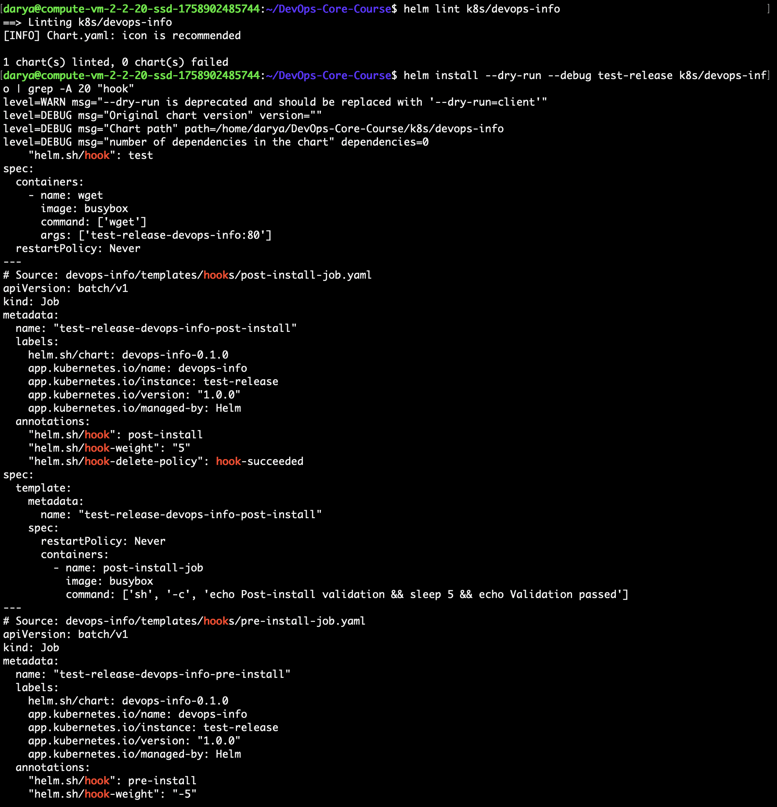

# Helm Chart Documentation — devops-info

## 1. Chart Overview

**Chart Name:** `devops-info`  
**Chart Version:** `0.1.0`  
**App Version:** `1.0`  

**Chart Structure:**

```
devops-info/
├── Chart.yaml          # Chart metadata
├── values.yaml         # Default values
├── values-dev.yaml     # Development environment overrides
├── values-prod.yaml    # Production environment overrides
├── charts/             # Chart dependencies (empty)
├── templates/          # Kubernetes manifests templates
│   ├── deployment.yaml # Deployment template
│   ├── service.yaml    # Service template
│   ├── _helpers.tpl    # Helper template functions
│   ├── hooks/
│   │   ├── pre-install-job.yaml
│   │   └── post-install-job.yaml
│   └── NOTES.txt       # Post-install instructions
└── .helmignore         # Files to ignore
```

**Key Templates & Purpose:**

- `deployment.yaml` — Defines the app Deployment; uses templated values for image, replicas, resources, and probes.
- `service.yaml` — Creates Service; type and ports are configurable via `values.yaml`.
- `_helpers.tpl` — Contains reusable template functions for names, labels, and selectors.
- `hooks/pre-install-job.yaml` — Pre-install hook for pre-deployment tasks (e.g., validation).
- `hooks/post-install-job.yaml` — Post-install hook for post-deployment validation.
- `NOTES.txt` — Instructions for accessing the app after install.

**Values Organization Strategy:**

- Default values in `values.yaml`.
- Environment-specific overrides in `values-dev.yaml` and `values-prod.yaml`.
- Values categorized by functionality:
  - `replicaCount` — number of replicas
  - `image.repository/tag` — Docker image
  - `resources` — CPU and memory limits/requests
  - `service.type` — NodePort or LoadBalancer
  - `livenessProbe` / `readinessProbe` — health checks





---

## 2. Configuration Guide

**Important Values & Purpose:**

| Value | Purpose |
|-------|---------|
| `replicaCount` | Number of pods to run |
| `image.repository` | Docker image repository |
| `image.tag` | Docker image tag/version |
| `service.type` | Service type (NodePort/LoadBalancer) |
| `resources` | CPU/memory limits and requests |
| `livenessProbe` / `readinessProbe` | Health checks for pods |

**Customizing for Different Environments:**

- **Development (`values-dev.yaml`):**
  - `replicaCount: 1`
  - Relaxed resources
  - Service type: NodePort
  - Latest image tag

- **Production (`values-prod.yaml`):**
  - `replicaCount: 5`
  - Proper CPU/memory resources
  - Service type: LoadBalancer
  - Fixed image tag

**Example Installations:**

```bash
# Install dev environment
helm install devops-dev k8s/devops-info -f k8s/devops-info/values-dev.yaml

# Upgrade to prod environment
helm upgrade devops-dev k8s/devops-info -f k8s/devops-info/values-prod.yaml
```


---

## 3. Hook Implementation

**Hooks Implemented:**

1. **Pre-install Hook** (`pre-install-job.yaml`)
   - Purpose: Run pre-install validation tasks.
   - Weight: `-5` (executes before main resources)
   - Deletion Policy: `hook-succeeded` (deleted after success)

2. **Post-install Hook** (`post-install-job.yaml`)
   - Purpose: Run post-install validation tasks.
   - Weight: `5` (executes after main resources)
   - Deletion Policy: `hook-succeeded` (deleted after success)

**Execution Flow:**

```
pre-install (weight -5) → deploy resources → post-install (weight 5)
```

**Deletion Policy Explanation:**

- Jobs are removed automatically after successful execution to avoid cluttering cluster with completed Jobs.


---

## 4. Installation Evidence

**Helm List and Deployed resourses**




**Hook Execution:**



**Environment-Specific Deployments:**

- Development:
  - 1 replica, NodePort, relaxed resources
  
  
   
- Production:
  - 5 replicas, LoadBalancer, proper resources
  
  


---

## 5. Operations

**Installation Commands:**

```bash
helm install devops-test k8s/devops-info
helm install devops-dev k8s/devops-info -f values-dev.yaml
```

**Upgrade a Release:**

```bash
helm upgrade devops-dev k8s/devops-info -f values-prod.yaml
```

**Rollback:**

```bash
helm rollback devops-dev <REVISION_NUMBER>
```

**Uninstall:**

```bash
helm uninstall devops-test
```

---

## 6. Testing & Validation

**Lint and Template output**



**Dry-Run Output:**




