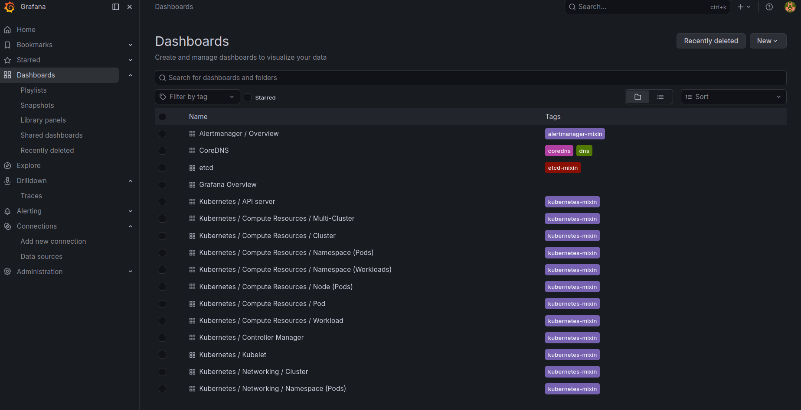
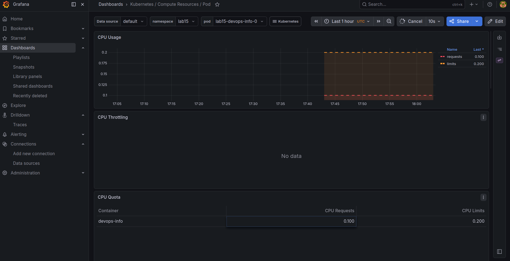
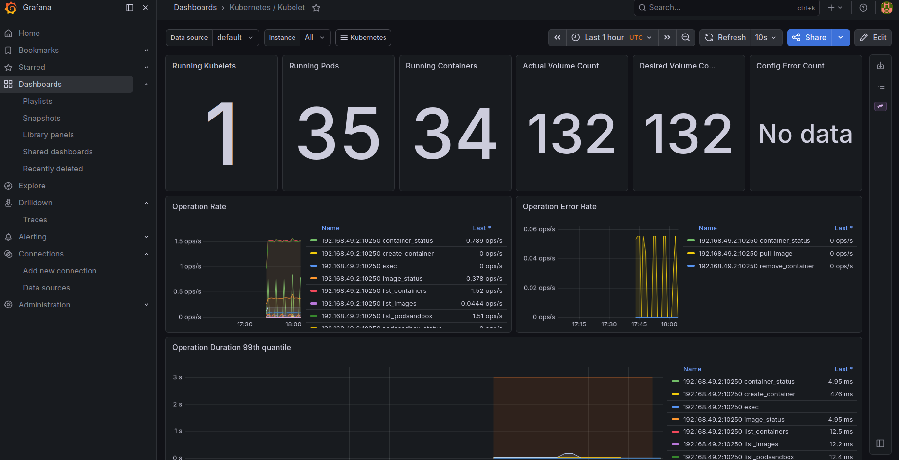
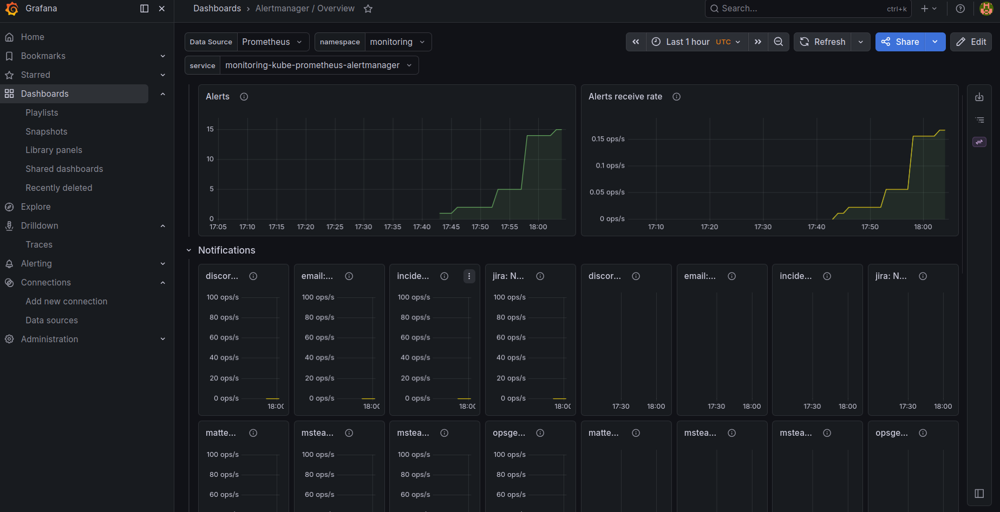

# Lab 16 — Kubernetes Monitoring & Init Containers
## 1. Kube-Prometheus Stack Components

The monitoring stack was installed with the `kube-prometheus-stack` Helm chart.

Components:

- **Prometheus Operator** — manages Prometheus, Alertmanager, ServiceMonitor, and related monitoring CRDs.
- **Prometheus** — collects and stores time-series metrics from Kubernetes components and workloads.
- **Alertmanager** — receives alerts from Prometheus and manages alert grouping, silencing, and notification routing.
- **Grafana** — provides dashboards for visualizing Prometheus metrics.
- **kube-state-metrics** — exposes Kubernetes object state metrics, such as pods, deployments, nodes, and namespaces.
- **node-exporter** — exposes node-level CPU, memory, disk, filesystem, and network metrics.

## 2. Installation Evidence

Command:

```bash
kubectl get po,svc -n monitoring
```

Output:

```text
NAME                                                         READY   STATUS    RESTARTS        AGE
pod/alertmanager-monitoring-kube-prometheus-alertmanager-0   2/2     Running   0               6m16s
pod/monitoring-grafana-6cc5968ddf-sw8c4                      3/3     Running   0               8m
pod/monitoring-kube-prometheus-operator-59754b75c4-24b7d     1/1     Running   2 (8m21s ago)   53m
pod/monitoring-kube-state-metrics-5957bd45bc-9hzr7           1/1     Running   8 (7m21s ago)   53m
pod/monitoring-prometheus-node-exporter-clxfk                1/1     Running   1 (10m ago)     53m
pod/prometheus-monitoring-kube-prometheus-prometheus-0       2/2     Running   0               6m25s

NAME                                              TYPE        CLUSTER-IP       EXTERNAL-IP   PORT(S)                      AGE
service/alertmanager-operated                     ClusterIP   None             <none>        9093/TCP,9094/TCP,9094/UDP   53m
service/monitoring-grafana                        ClusterIP   10.107.151.12    <none>        80/TCP                       53m
service/monitoring-kube-prometheus-alertmanager   ClusterIP   10.101.19.41     <none>        9093/TCP,8080/TCP            53m
service/monitoring-kube-prometheus-operator       ClusterIP   10.106.183.204   <none>        443/TCP                      53m
service/monitoring-kube-prometheus-prometheus     ClusterIP   10.109.78.135    <none>        9090/TCP,8080/TCP            53m
service/monitoring-kube-state-metrics             ClusterIP   10.102.30.87     <none>        8080/TCP                     53m
service/monitoring-prometheus-node-exporter       ClusterIP   10.98.174.15     <none>        9100/TCP                     53m
service/prometheus-operated                       ClusterIP   None             <none>        9090/TCP                     53m
```

Grafana was accessed through port-forwarding:

```bash
kubectl port-forward svc/monitoring-grafana -n monitoring 3000:80
```

Because the cluster was running on a VM, Grafana was accessed locally through an SSH tunnel:

```bash
ssh -L 3000:localhost:3000 darya@<VM_EXTERNAL_IP>
```

Grafana URL:

```text
http://localhost:3000
```



## 3. Grafana Dashboard Answers

### 3.1 StatefulSet CPU and Memory

Dashboard used:

```text
Kubernetes / Compute Resources / Pod
```

Namespace:

```text
lab15
```

Pod checked:

```text
lab15-devops-info-0
```

Observed values:

```text
CPU request: 0.100 cores
CPU limit:   0.200 cores
CPU throttling: no data
```

The StatefulSet pod `lab15-devops-info-0` was visible in Grafana. CPU usage was low because the Flask application was mostly idle.



### 3.2 Default Namespace CPU Usage

Dashboard used:

```text
Kubernetes / Compute Resources / Namespace (Pods)
```

Namespace:

```text
default
```

Observed result:

```text
No active pod CPU usage data was shown for the selected time range.
```

The dashboard displayed quota/request lines, but no current pod CPU usage data for the `default` namespace during the selected time range.

### 3.3 Node Metrics

Dashboard used:

```text
Node Exporter / Nodes
```

Observed node:

```text
192.168.49.2:9100
```

Observed values:

```text
Logical CPU cores: 8
Memory usage: approximately 25.9%
Total memory: about 16 GiB
Used memory: about 4 GiB
/data disk size: 30.5 GB
/data disk used: 20.6 GB
/data disk usage: 67%
```

### 3.4 Kubelet Pods and Containers

Dashboard used:

```text
Kubernetes / Kubelet
```

Observed values:

```text
Nodes: 1
Pods: 34
Containers: 33
Kubelet object counters: 130 / 130
```

The Kubelet dashboard also showed operation metrics such as container status, image status, list containers, and pod sandbox operations.



### 3.5 Network Traffic

Dashboard used:

```text
Kubernetes / Networking / Namespace (Pods)
```

Namespace filter:

```text
All
```

Observed result:

```text
Current Rate of Bits Received: No data
Current Rate of Bits Transmitted: No data
Current Network Usage: No data
```

The selected dashboard did not show current network traffic data during the selected time range.

### 3.6 Alerts

Dashboard used:

```text
Alertmanager / Overview
```

Observed result:

```text
Active alerts: 5
```

Alertmanager showed 5 active alerts during the selected time range.



## 4. Init Containers

A pod with two init containers was created in the `lab16` namespace.

The first init container implemented the wait-for-service pattern. It waited until the Kubernetes service DNS name was resolvable.

The second init container downloaded a file from `https://example.com` into a shared `emptyDir` volume.

The main container mounted the same volume and verified that the downloaded file was available at `/data/index.html`.

### 4.1 Pod Status

Command:

```bash
kubectl get pod init-demo -n lab16
```

Output:

```text
NAME        READY   STATUS    RESTARTS   AGE
init-demo   1/1     Running   0          12s
```

### 4.2 Wait-for-Service Init Container

Command:

```bash
kubectl logs init-demo -n lab16 -c wait-for-service
```

Output:

```text
Server:		10.96.0.10
Address:	10.96.0.10:53

Name:	kubernetes.default.svc.cluster.local
Address: 10.96.0.1

kubernetes service is reachable
```

This proves that the init container waited until the Kubernetes service DNS name was available.

### 4.3 Download Init Container

Command:

```bash
kubectl logs init-demo -n lab16 -c init-download
```

Output:

```text
Connecting to example.com (8.6.112.0:443)
wget: note: TLS certificate validation not implemented
saving to '/work-dir/index.html'
index.html           100% |********************************|   528  0:00:00 ETA
'/work-dir/index.html' saved
download complete
total 12
drwxrwxrwx    2 root     root          4096 May 14 17:58 .
drwxr-xr-x    1 root     root          4096 May 14 17:58 ..
-rw-r--r--    1 root     root           528 May 14 17:58 index.html
```

This proves that the init container downloaded `index.html` into the shared volume.

### 4.4 Main Container Verification

Command:

```bash
kubectl exec init-demo -n lab16 -- cat /data/index.html
```

Output:

```text
Defaulted container "main-app" out of: main-app, wait-for-service (init), init-download (init)
<!doctype html><html lang="en"><head><title>Example Domain</title><meta name="viewport" content="width=device-width, initial-scale=1"><style>body{background:#eee;width:60vw;margin:15vh auto;font-family:system-ui,sans-serif}h1{font-size:1.5em}div{opacity:0.8}a:link,a:visited{color:#348}</style></head><body><div><h1>Example Domain</h1><p>This domain is for use in documentation examples without needing permission. Avoid use in operations.</p><p><a href="https://iana.org/domains/example">Learn more</a></p></div></body></html>
```

This proves that the main container could read the file downloaded by the init container.

## 5. Init Container Manifest

```yaml
apiVersion: v1
kind: Namespace
metadata:
  name: lab16
---
apiVersion: v1
kind: Pod
metadata:
  name: init-demo
  namespace: lab16
  labels:
    app: init-demo
spec:
  initContainers:
    - name: wait-for-service
      image: busybox:1.36
      command:
        - sh
        - -c
        - |
          until nslookup kubernetes.default.svc.cluster.local; do
            echo "waiting for kubernetes service"
            sleep 2
          done
          echo "kubernetes service is reachable"

    - name: init-download
      image: busybox:1.36
      command:
        - sh
        - -c
        - |
          wget -O /work-dir/index.html https://example.com
          echo "download complete"
          ls -la /work-dir
      volumeMounts:
        - name: workdir
          mountPath: /work-dir

  containers:
    - name: main-app
      image: busybox:1.36
      command:
        - sh
        - -c
        - |
          echo "main container started"
          echo "downloaded file:"
          cat /data/index.html
          sleep 3600
      volumeMounts:
        - name: workdir
          mountPath: /data

  volumes:
    - name: workdir
      emptyDir: {}
```

## 6. Conclusion

The kube-prometheus-stack was installed successfully and provided Prometheus, Grafana, Alertmanager, kube-state-metrics, node-exporter, and Prometheus Operator components.

Grafana dashboards were used to inspect pod resources, namespace usage, node resources, Kubelet metrics, network metrics, and Alertmanager alerts.

Init containers were implemented successfully for both required patterns:

- waiting for a dependency service;
- downloading a file before the main application starts.

The main container successfully accessed the file created by the init container through a shared volume.
