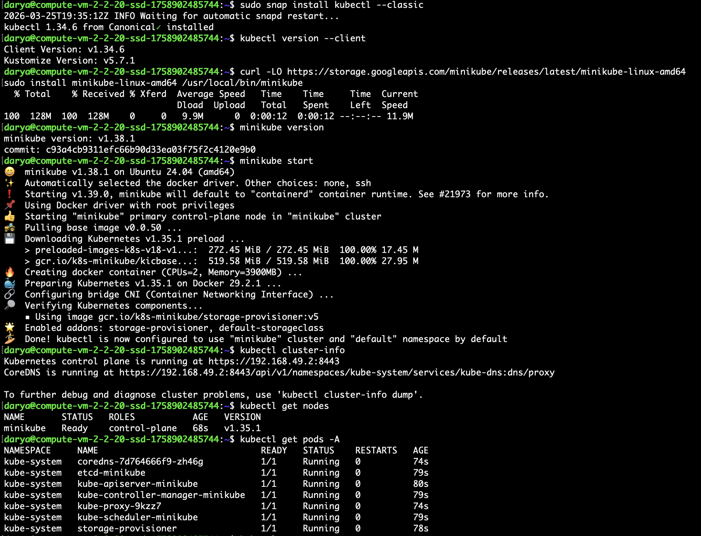
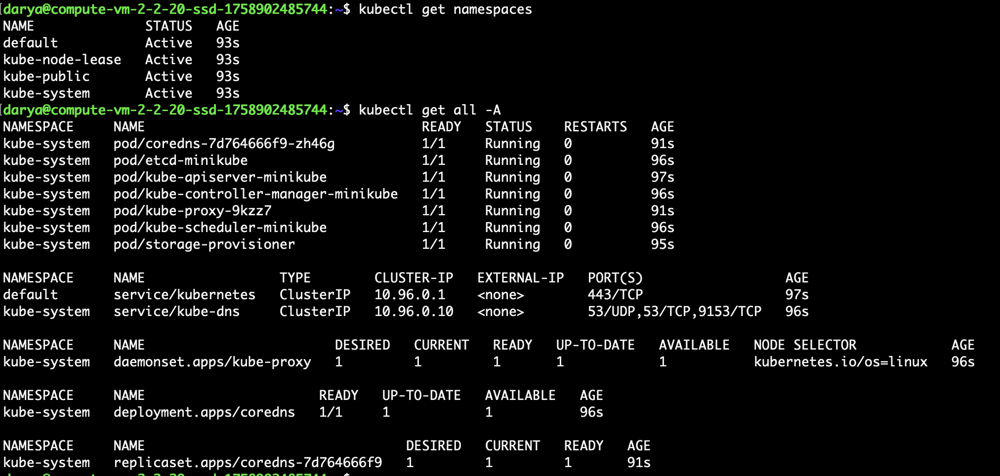
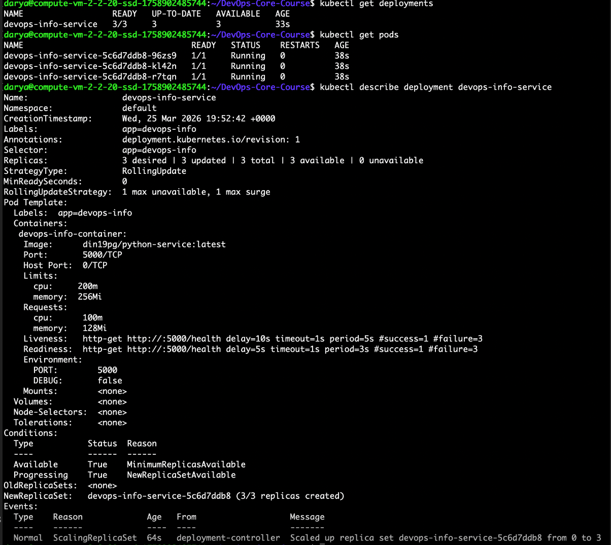
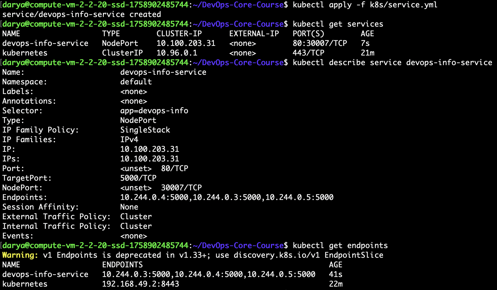
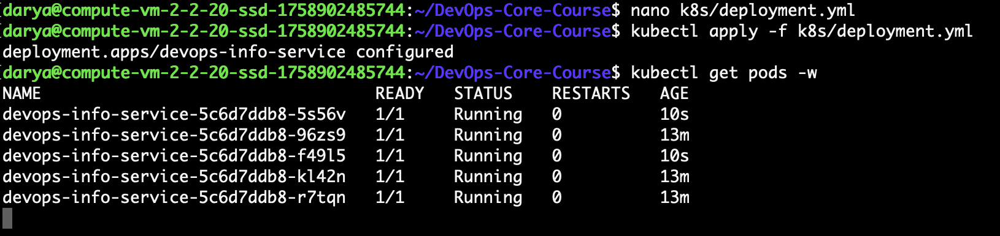
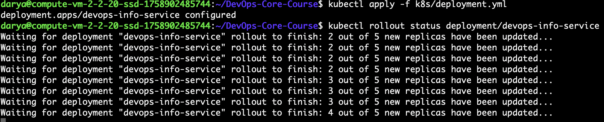
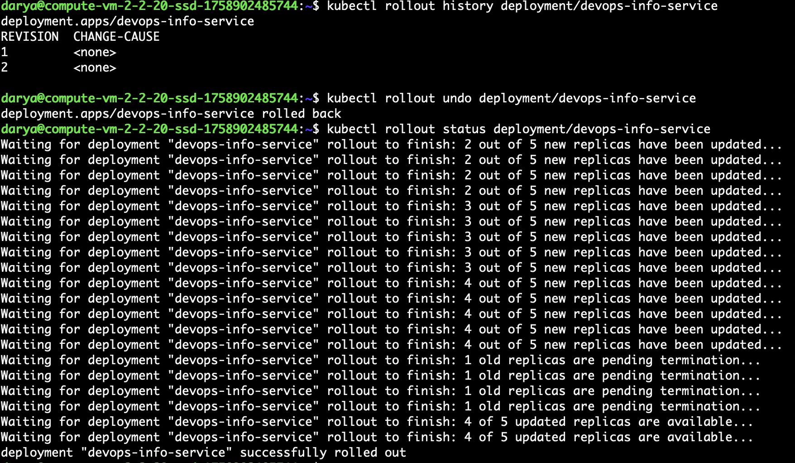

# Lab 9 — Kubernetes Fundamentals


## 1. Architecture Overview

This project deploys the **devops-info-service** application to a local Kubernetes cluster using **minikube**.


**Architecture Diagram**:
```text
+------------------+        +-----------------------------------+        +--------------------------------+
| User / Browser   | -----> | Service: devops-info-service     | -----> | Deployment: devops-info-service |
|                  |        | Type: NodePort                   |        | Replicas: 5                     |
| Request to app   |        | Port: 80                         |        |                                 |
|                  |        | NodePort: 30007                  |        |  Pod 1  -> :5000                |
+------------------+        +-----------------------------------+       |  Pod 2  -> :5000                |
                                                                        |  Pod 3  -> :5000                |
                                                                        |  Pod 4  -> :5000                |
                                                                        |  Pod 5  -> :5000                |
                                                                        +---------------------------------+
```

Resource configuration from the manifests:
- Requests: `100m CPU`, `128Mi memory`
- Limits: `200m CPU`, `256Mi memory`

---

## 2. Manifest Files

### `k8s/deployment.yml`
This file defines the Deployment for the Python application.

Key configuration:
- image: `din19pg/python-service:latest`
- 5 replicas
- port `5000`
- liveness and readiness probes on `/health`
- resource requests and limits
- RollingUpdate strategy (`maxUnavailable: 1`, `maxSurge: 1`)

### `k8s/service.yml`
This file defines the Service that exposes the Deployment.

Key configuration:
- type: `NodePort`
- port `80`
- targetPort `5000`
- nodePort `30007`
- selector: `app=devops-info`

---

## 3. Deployment Evidence

### Cluster Setup
The local cluster was created with **minikube**.

Commands used:
```bash
    kubectl version --client
    minikube version
    minikube start
    kubectl cluster-info
    kubectl get nodes
    kubectl get pods -A
    kubectl get namespaces
    kubectl get all -A
```

Result:
- minikube started successfully
- the node status was `Ready`
- Kubernetes system components were running





---

### Deployment
The Deployment was applied with:
```bash
    kubectl apply -f k8s/deployment.yml
```

Verification commands:
```bash
    kubectl get deployments
    kubectl get pods
    kubectl describe deployment devops-info-service
```

Result:
- Deployment created successfully
- Pods reached `Running` state
- health checks and resource settings were visible in `describe`



---

### Service
The Service was created with:
```bash
    kubectl apply -f k8s/service.yml
```

Verification commands:
```bash
    kubectl get services
    kubectl describe service devops-info-service
    kubectl get endpoints
```

Result:
- Service type was `NodePort`
- nodePort `30007` was assigned
- endpoints were linked to application Pods



---

## 4. Operations Performed

### Deploy
```bash
    kubectl apply -f k8s/deployment.yml
    kubectl apply -f k8s/service.yml
```

### Scale
The Deployment was scaled and verified at **5 replicas**.

Commands used:
```bash
    kubectl apply -f k8s/deployment.yml
    kubectl get pods -w
```

Result:
- 5 Pods were running successfully



### Rolling Update
A rolling update was performed by reapplying the Deployment manifest.

Commands used:
```bash
    kubectl apply -f k8s/deployment.yml
    kubectl rollout status deployment/devops-info-service
```

Result:
- Pods were updated gradually
- rollout completed successfully
- the application remained available during the update



### Rollback
Rollback was demonstrated with:
```bash
    kubectl rollout history deployment/devops-info-service
    kubectl rollout undo deployment/devops-info-service
    kubectl rollout status deployment/devops-info-service
```

Result:
- the previous revision was restored successfully


---

## 5. Production Considerations

### Health Checks
Liveness and readiness probes were configured on `/health`. This helps Kubernetes restart unhealthy containers and send traffic only to ready Pods.

### Resource Limits
CPU and memory requests/limits were added to improve scheduling and prevent excessive resource usage.

### Possible Production Improvements
For a real production environment, I would also add:
- Ingress instead of only NodePort
- TLS/HTTPS
- ConfigMaps and Secrets
- monitoring and logging
- Horizontal Pod Autoscaler

---

## 6. Challenges and Solutions

### Challenge 1: Watching rollout progress
During rollout and rollback, Kubernetes updated Pods gradually, so the process took time.

**Solution:**  
I used:
```bash
    kubectl rollout status deployment/devops-info-service
    kubectl get pods -w
```

### Challenge 2: Verifying the Service selector
It was necessary to confirm that the Service routed traffic to the correct Pods.

**Solution:**  
I used:
```bash
    kubectl describe service devops-info-service
    kubectl get endpoints
```

### What I Learned
In this lab, I learned:
- how to deploy applications with Kubernetes manifests
- how Deployments manage replicas and updates
- how Services expose Pods
- how readiness/liveness probes improve reliability
- how rollback works in Kubernetes
