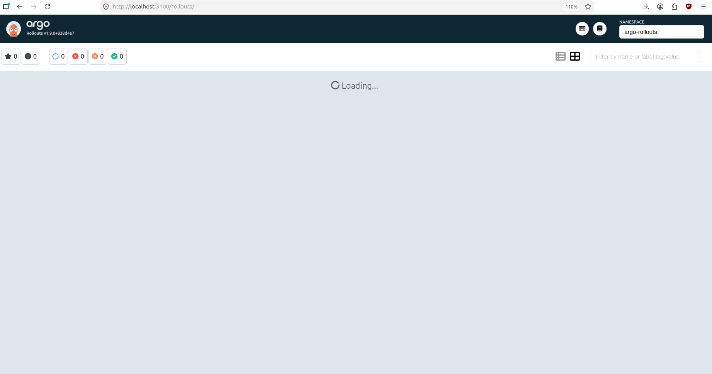
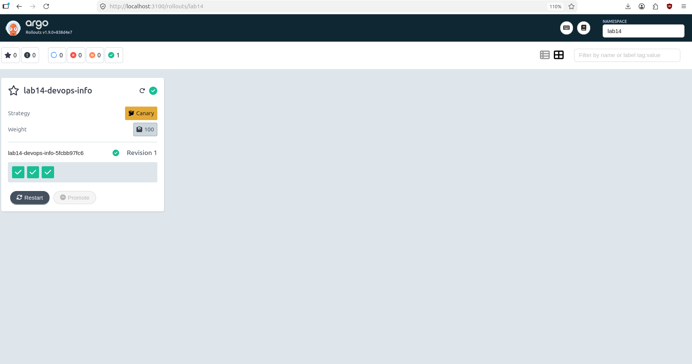
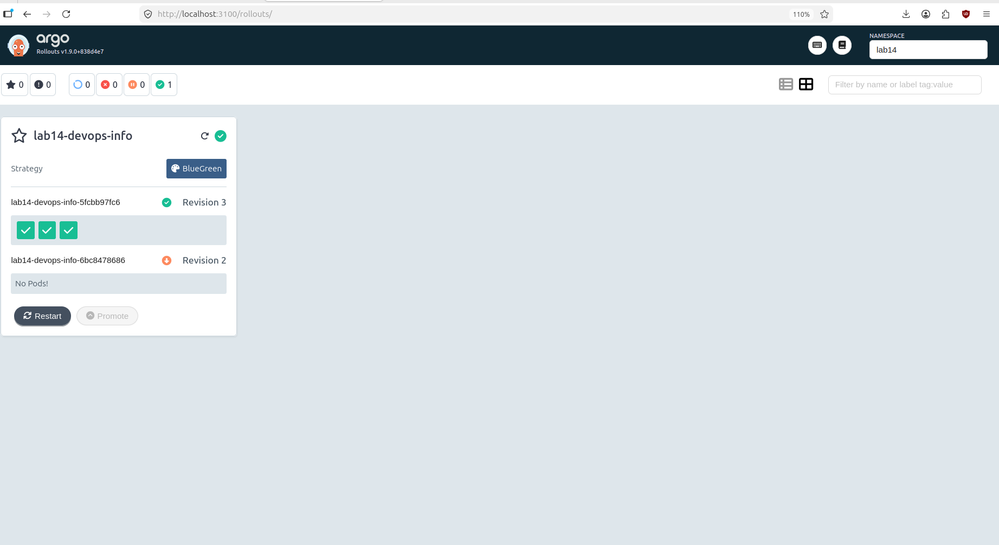

# Lab 14 — Progressive Delivery with Argo Rollouts

## 1. Argo Rollouts Setup

Argo Rollouts controller and dashboard were installed in the `argo-rollouts` namespace.

Command:

```bash
kubectl get pods -n argo-rollouts
```

Output:

```text
NAME                                      READY   STATUS    RESTARTS   AGE
argo-rollouts-5f64f8d68-hgrkm             1/1     Running   0          71m
argo-rollouts-dashboard-755bbc64c-mbkcd   1/1     Running   0          69m
```

The `kubectl-argo-rollouts` plugin was installed.

Command:

```bash
kubectl argo rollouts version
```

Output:

```text
kubectl-argo-rollouts: v1.9.0+838d4e7
  BuildDate: 2026-03-20T21:08:11Z
  GitCommit: 838d4e792be666ec11bd0c80331e0c5511b5010e
  GitTreeState: clean
  GoVersion: go1.24.13
  Compiler: gc
  Platform: linux/amd64
```

The dashboard was accessed through SSH tunneling.

```bash
kubectl argo rollouts dashboard -n lab14 --port 3100
```

Dashboard URL:

```text
http://localhost:3100
```



## 2. Rollout vs Deployment

A Kubernetes Deployment performs standard rolling updates. It replaces old pods with new pods, but does not provide advanced progressive delivery controls.

An Argo Rollout uses a similar pod template structure, but adds progressive delivery strategies such as:

- Canary deployments;
- Blue-Green deployments;
- manual promotion;
- abort and rollback support;
- preview services;
- traffic shifting steps.

The application was deployed as an Argo Rollout instead of a Deployment for Lab 14.

## 3. Canary Deployment

The Rollout was first configured with the Canary strategy.

Canary steps:

```yaml
strategy:
  canary:
    steps:
      - setWeight: 20
      - pause: {}
      - setWeight: 40
      - pause:
          duration: 30s
      - setWeight: 60
      - pause:
          duration: 30s
      - setWeight: 80
      - pause:
          duration: 30s
      - setWeight: 100
```

Initial Rollout verification:

```bash
kubectl get po,rollout,rs,svc,pvc -n lab14
```

Output:

```text
NAME                                       READY   STATUS      RESTARTS   AGE
pod/lab14-devops-info-5fcbb97fc6-8vwdv     1/1     Running     0          34s
pod/lab14-devops-info-5fcbb97fc6-jqmr9     1/1     Running     0          34s
pod/lab14-devops-info-5fcbb97fc6-nt8bm     1/1     Running     0          34s
pod/lab14-devops-info-post-install-g67wf   0/1     Completed   0          6m30s
pod/lab14-devops-info-pre-install-wfv2f    0/1     Completed   0          6m39s

NAME                                    DESIRED   CURRENT   UP-TO-DATE   AVAILABLE   AGE
rollout.argoproj.io/lab14-devops-info   3         3         3            3           6m30s

NAME                                           DESIRED   CURRENT   READY   AGE
replicaset.apps/lab14-devops-info-5fcbb97fc6   3         3         3       6m30s

NAME                                 TYPE        CLUSTER-IP      EXTERNAL-IP   PORT(S)    AGE
service/lab14-devops-info            ClusterIP   10.101.248.21   <none>        80/TCP     6m30s
service/lab14-devops-info-headless   ClusterIP   None            <none>        5000/TCP   6m30s

NAME                                           STATUS   VOLUME                                     CAPACITY   ACCESS MODES   STORAGECLASS   AGE
persistentvolumeclaim/lab14-devops-info-data   Bound    pvc-c7e6a521-b4e1-45c2-a6f9-5fed2599ebfd   100Mi      RWO            standard       6m30s
```

Rollout status:

```bash
kubectl argo rollouts get rollout lab14-devops-info -n lab14
```

Output:

```text
Name:            lab14-devops-info
Namespace:       lab14
Status:          ✔ Healthy
Strategy:        Canary
  Step:          9/9
  SetWeight:     100
  ActualWeight:  100
Images:          din19pg/python-service:latest (stable)
Replicas:
  Desired:       3
  Current:       3
  Updated:       3
  Ready:         3
  Available:     3
```

A Canary update was triggered by changing the pod template annotation:

```bash
kubectl patch rollout lab14-devops-info -n lab14 --type merge -p \
'{"spec":{"template":{"metadata":{"annotations":{"lab14-change":"canary-v2"}}}}}'
```

The Rollout paused during the configured manual promotion step and then continued after promotion.

Promotion command:

```bash
kubectl argo rollouts promote lab14-devops-info -n lab14
```

After promotion, the new revision became stable.



## 4. Canary Abort / Rollback Test

A new Canary revision was started for abort testing.

Command:

```bash
kubectl patch rollout lab14-devops-info -n lab14 --type merge -p \
'{"spec":{"template":{"metadata":{"annotations":{"lab14-change":"canary-v3-abort"}}}}}'
```

Before abort:

```text
Status:          ◌ Progressing
Message:         more replicas need to be updated
Strategy:        Canary
  Step:          0/9
  SetWeight:     20
  ActualWeight:  0
Images:          din19pg/python-service:latest (canary, stable)
Replicas:
  Desired:       3
  Current:       4
  Updated:       1
  Ready:         3
  Available:     3

revision:3 ReplicaSet lab14-devops-info-fdb7b6868 canary
revision:2 ReplicaSet lab14-devops-info-66bd8d9cb4 stable
```

Abort command:

```bash
kubectl argo rollouts abort lab14-devops-info -n lab14
```

After abort:

```text
Name:            lab14-devops-info
Namespace:       lab14
Status:          ✖ Degraded
Message:         RolloutAborted: Rollout aborted update to revision 3
Strategy:        Canary
  Step:          0/9
  SetWeight:     0
  ActualWeight:  0
Images:          din19pg/python-service:latest (stable)
Replicas:
  Desired:       3
  Current:       3
  Updated:       0
  Ready:         3
  Available:     3

revision:3 ReplicaSet lab14-devops-info-fdb7b6868 ScaledDown
revision:2 ReplicaSet lab14-devops-info-66bd8d9cb4 Healthy stable
```

The abort stopped the new Canary revision and kept the stable revision active.

## 5. Blue-Green Deployment

The Rollout was then switched to the Blue-Green strategy.

Blue-Green strategy:

```yaml
strategy:
  blueGreen:
    activeService: lab14-devops-info
    previewService: lab14-devops-info-preview
    autoPromotionEnabled: false
```

The active and preview services were created successfully.

Command:

```bash
kubectl get svc -n lab14
```

Output:

```text
NAME                         TYPE        CLUSTER-IP       EXTERNAL-IP   PORT(S)    AGE
lab14-devops-info            ClusterIP   10.101.248.21    <none>        80/TCP     60m
lab14-devops-info-headless   ClusterIP   None             <none>        5000/TCP   60m
lab14-devops-info-preview    ClusterIP   10.111.199.251   <none>        80/TCP     14m
```

Blue-Green Rollout verification:

```bash
kubectl argo rollouts get rollout lab14-devops-info -n lab14
```

Output:

```text
Name:            lab14-devops-info
Namespace:       lab14
Status:          ✔ Healthy
Strategy:        BlueGreen
Images:          din19pg/python-service:latest (stable, active)
Replicas:
  Desired:       3
  Current:       3
  Updated:       3
  Ready:         3
  Available:     3

revision:1 ReplicaSet lab14-devops-info-5fcbb97fc6 stable,active
```

A new Blue-Green revision was triggered with a pod template annotation change.

```bash
kubectl patch rollout lab14-devops-info -n lab14 --type merge -p \
'{"spec":{"template":{"metadata":{"annotations":{"bluegreen-change":"green-v2"}}}}}'
```

After promotion, revision 2 became stable and active:

```text
Name:            lab14-devops-info
Namespace:       lab14
Status:          ✔ Healthy
Strategy:        BlueGreen
Images:          din19pg/python-service:latest (active, stable)
Replicas:
  Desired:       3
  Current:       6
  Updated:       3
  Ready:         3
  Available:     3

revision:2 ReplicaSet lab14-devops-info-6bc8478686 stable,active
revision:1 ReplicaSet lab14-devops-info-5fcbb97fc6 delay
```

This shows that Blue-Green temporarily kept both versions running during the transition.

## 6. Blue-Green Rollback

Rollback was tested with:

```bash
kubectl argo rollouts undo lab14-devops-info -n lab14
```

The previous version was created as a preview revision:

```text
Status:          ॥ Paused
Message:         BlueGreenPause
Strategy:        BlueGreen
Images:          din19pg/python-service:latest (active, preview, stable)

revision:3 ReplicaSet lab14-devops-info-5fcbb97fc6 preview
revision:2 ReplicaSet lab14-devops-info-6bc8478686 stable,active
```

After manual promotion:

```bash
kubectl argo rollouts promote lab14-devops-info -n lab14
```

Rollback completed successfully:

```text
Name:            lab14-devops-info
Namespace:       lab14
Status:          ✔ Healthy
Strategy:        BlueGreen
Images:          din19pg/python-service:latest (active, stable)
Replicas:
  Desired:       3
  Current:       6
  Updated:       3
  Ready:         3
  Available:     3

revision:3 ReplicaSet lab14-devops-info-5fcbb97fc6 stable,active
revision:2 ReplicaSet lab14-devops-info-6bc8478686 delay
```



This demonstrates instant service switching after promotion.

## 7. Strategy Comparison

| Strategy | Use Case | Pros | Cons |
|---|---|---|---|
| Canary | Gradual production rollout | Limits blast radius, supports staged validation | Slower rollout, may need traffic management for exact percentages |
| Blue-Green | Fast release with preview testing | Instant switch, easy rollback, preview environment | Requires double capacity during transition |

Recommended usage:

- Use Canary when a release should be gradually exposed to users.
- Use Blue-Green when the new version should be tested in preview and then switched instantly.
- Use Blue-Green for fast rollback scenarios.
- Use Canary when risk should be reduced through progressive traffic shifting.

## 8. CLI Commands Reference

Install and verify Argo Rollouts:

```bash
kubectl create namespace argo-rollouts
kubectl apply -n argo-rollouts -f https://github.com/argoproj/argo-rollouts/releases/latest/download/install.yaml
kubectl get pods -n argo-rollouts
kubectl argo rollouts version
```

Dashboard:

```bash
kubectl argo rollouts dashboard -n lab14 --port 3100
```

Deploy Helm chart:

```bash
helm upgrade --install lab14 ./k8s/devops-info -n lab14 --create-namespace -f ./k8s/devops-info/values-rollout.yaml
```

Inspect Rollout:

```bash
kubectl get po,rollout,rs,svc,pvc -n lab14
kubectl argo rollouts get rollout lab14-devops-info -n lab14
```

Trigger a new revision:

```bash
kubectl patch rollout lab14-devops-info -n lab14 --type merge -p \
'{"spec":{"template":{"metadata":{"annotations":{"lab14-change":"canary-v2"}}}}}'
```

Promote:

```bash
kubectl argo rollouts promote lab14-devops-info -n lab14
```

Abort:

```bash
kubectl argo rollouts abort lab14-devops-info -n lab14
```

Undo:

```bash
kubectl argo rollouts undo lab14-devops-info -n lab14
```
