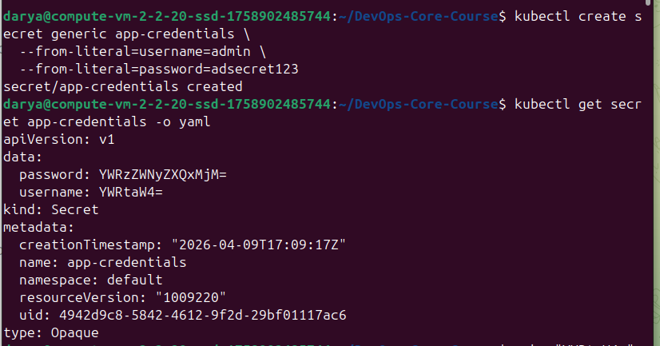
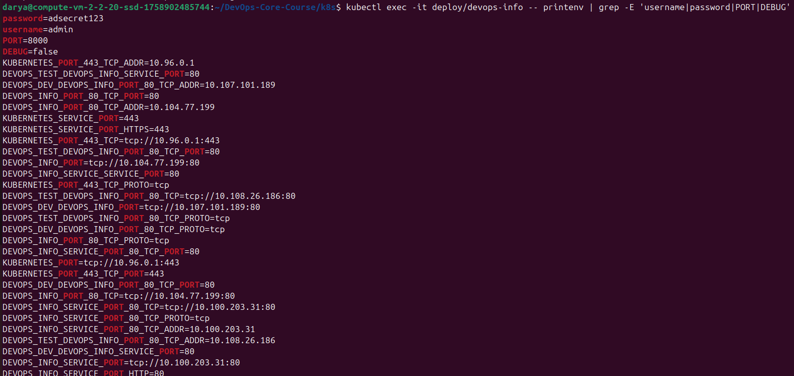
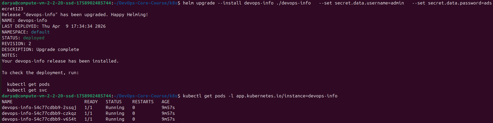
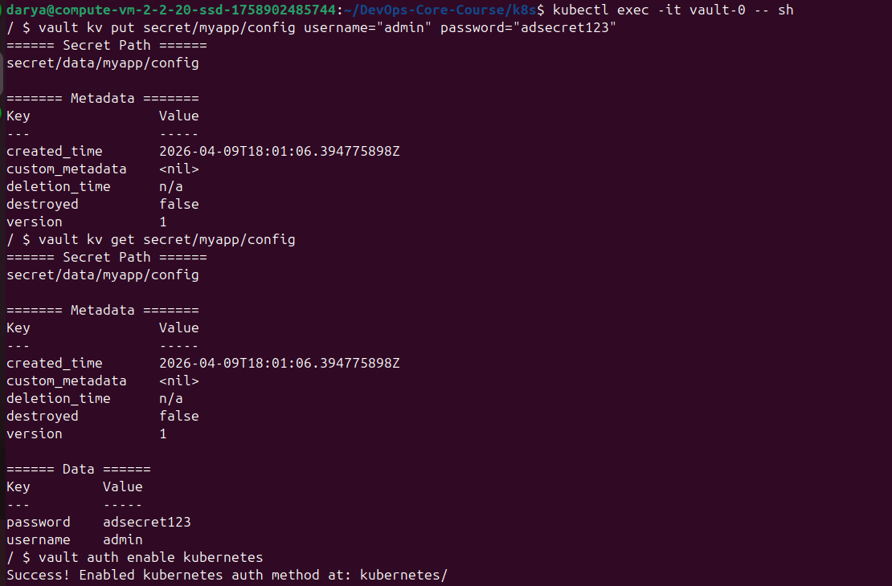
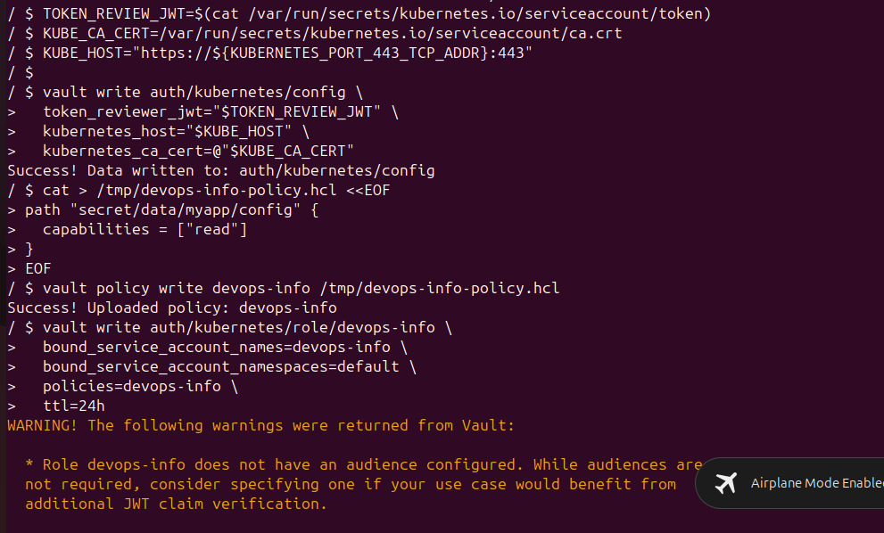
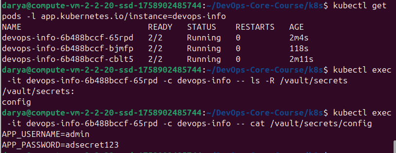

# Lab 11 — Kubernetes Secrets & HashiCorp Vault

## 1. Kubernetes Secrets

### 1.1 Create a Secret

```bash
kubectl create secret generic app-credentials \
  --from-literal=username=admin \
  --from-literal=password=adsecret123
```

### 1.2 View Secret YAML

```bash
kubectl get secret app-credentials -o yaml
```

Output:

```yaml
apiVersion: v1
kind: Secret
metadata:
  name: app-credentials
type: Opaque
data:
  username: YWRtaW4=
  password: YWRzZWNyZXQxMjM=
```



### 1.3 Decode Base64 Values

```bash
echo "YWRtaW4=" | base64 -d
echo "YWRzZWNyZXQxMjM=" | base64 -d
```

Decoded values:

```text
admin
adsecret123
```


### 1.4 Encoding vs Encryption

Kubernetes Secrets store data in base64 format.  
Base64 is **encoding**, not encryption.  
Anyone with access to the Secret can decode it.

### 1.5 Security Implications

By default, Kubernetes Secrets are **not encrypted at rest** unless etcd encryption is enabled.  
etcd encryption should be enabled in production or when storing real credentials.

---

## 2. Helm Secret Integration

### 2.1 Chart Structure

```text
devops-info/
├── Chart.yaml
├── values.yaml
└── templates/
    ├── deployment.yaml
    ├── secrets.yaml
    ├── service.yaml
    ├── serviceaccount.yaml
    └── _helpers.tpl
```

### 2.2 Secret Template

File: `templates/secrets.yaml`

```yaml
{{- if .Values.secret.create }}
apiVersion: v1
kind: Secret
metadata:
  name: {{ default (printf "%s-secret" (include "devops-info.fullname" .)) .Values.secret.name }}
  labels:
    {{- include "devops-info.labels" . | nindent 4 }}
type: Opaque
stringData:
  username: {{ .Values.secret.data.username | quote }}
  password: {{ .Values.secret.data.password | quote }}
{{- end }}
```

### 2.3 Secret Values in `values.yaml`

```yaml
secret:
  create: true
  name: ""
  data:
    username: "admin"
    password: "adsecret123"
```

### 2.4 Secret Injection into Deployment

```yaml
envFrom:
  - secretRef:
      name: {{ include "devops-info.secretName" . }}
```

### 2.5 Verification

```bash
kubectl get pods -l app.kubernetes.io/instance=devops-info
```

Output:

```text
NAME                           READY   STATUS    RESTARTS   AGE
devops-info-54c77cdbb9-2ssqj   1/1     Running   0          ...
devops-info-54c77cdbb9-czkqz   1/1     Running   0          ...
devops-info-54c77cdbb9-v654t   1/1     Running   0          ...
```

Secrets inside pod:

```bash
kubectl exec -it deploy/devops-info -- sh -c 'printenv | egrep "^(username|password|PORT|DEBUG)="'
```

Output:

```text
username=admin
password=adsecret123
PORT=8000
DEBUG=false
```




`kubectl describe pod` showed only the Secret reference, not the values:

```text
Environment Variables from:
  devops-info-secret  Secret  Optional: false
Environment:
  PORT:   8000
  DEBUG:  false
```

---

## 3. Resource Management

### 3.1 Resource Requests and Limits

```yaml
resources:
  limits:
    cpu: 200m
    memory: 256Mi
  requests:
    cpu: 100m
    memory: 128Mi
```

### 3.2 Verification

`kubectl describe pod`:

```text
Limits:
  cpu:     200m
  memory:  256Mi
Requests:
  cpu:     100m
  memory:  128Mi
```

### 3.3 Requests vs Limits

- `requests` — minimum resources reserved for the container
- `limits` — maximum resources the container can use

---

## 4. Vault Integration

### 4.1 Install Vault

```bash
helm install vault ./vault-helm \
  --set "server.dev.enabled=true" \
  --set "injector.enabled=true"
```

### 4.2 Verify Vault Pods

```bash
kubectl get pods | grep vault
```



### 4.3 Create Secret in Vault

```bash
vault kv put secret/myapp/config username="admin" password="adsecret123"
vault kv get secret/myapp/config
```



### 4.4 Configure Kubernetes Auth

```bash
vault auth enable kubernetes

TOKEN_REVIEW_JWT=$(cat /var/run/secrets/kubernetes.io/serviceaccount/token)
KUBE_CA_CERT=/var/run/secrets/kubernetes.io/serviceaccount/ca.crt
KUBE_HOST="https://${KUBERNETES_PORT_443_TCP_ADDR}:443"

vault write auth/kubernetes/config \
  token_reviewer_jwt="$TOKEN_REVIEW_JWT" \
  kubernetes_host="$KUBE_HOST" \
  kubernetes_ca_cert=@"$KUBE_CA_CERT"
```

### 4.5 Policy and Role

Policy:

```hcl
path "secret/data/myapp/config" {
  capabilities = ["read"]
}
```

Role:

```bash
vault write auth/kubernetes/role/devops-info \
  bound_service_account_names=devops-info \
  bound_service_account_namespaces=default \
  policies=devops-info \
  ttl=24h
```



### 4.6 Vault Annotations in Deployment

```yaml
annotations:
  vault.hashicorp.com/agent-inject: "true"
  vault.hashicorp.com/role: "devops-info"
  vault.hashicorp.com/agent-inject-secret-config: "secret/data/myapp/config"
  vault.hashicorp.com/agent-inject-template-config: |
    {{- with secret "secret/data/myapp/config" -}}
    APP_USERNAME={{ .Data.data.username }}
    APP_PASSWORD={{ .Data.data.password }}
    {{- end }}
```

### 4.7 Verify Sidecar Injection

```bash
kubectl get pods -l app.kubernetes.io/instance=devops-info
```

Output:

```text
NAME                          READY   STATUS    RESTARTS   AGE
devops-info-6b488bccf-65rpd   2/2     Running   0          ...
devops-info-6b488bccf-bjmfp   2/2     Running   0          ...
devops-info-6b488bccf-cblt5   2/2     Running   0          ...
```

This confirms Vault sidecar injection worked.

### 4.8 Proof of Secret Injection

```bash
kubectl exec -it devops-info-6b488bccf-65rpd -c devops-info -- ls -R /vault/secrets
kubectl exec -it devops-info-6b488bccf-65rpd -c devops-info -- cat /vault/secrets/config
```

Output:

```text
APP_USERNAME=admin
APP_PASSWORD=adsecret123
```



### 4.9 Sidecar Injection Pattern

Vault Injector adds `vault-agent-init` and `vault-agent` containers to the Pod.  
Secrets are rendered into files inside `/vault/secrets`.

---

## 5. Security Analysis

### Kubernetes Secrets vs Vault

- **Kubernetes Secrets**: simple, built-in, but only base64 encoded by default
- **Vault**: external secret manager with stronger access control and secret injection

### When to Use Each

- Use **Kubernetes Secrets** for simple apps and labs
- Use **Vault** for production and stronger secret management

### Production Recommendations

- enable etcd encryption at rest
- restrict Secret access with RBAC
- do not store real secrets in Git
- use Vault or another external secret manager in production

---

## 6. Bonus

### 6.1 Vault Agent Template

```yaml
vault.hashicorp.com/agent-inject-template-config: |
  {{- with secret "secret/data/myapp/config" -}}
  APP_USERNAME={{ .Data.data.username }}
  APP_PASSWORD={{ .Data.data.password }}
  {{- end }}
```

### 6.2 Named Template in `_helpers.tpl`

```yaml
{{- define "devops-info.commonEnv" -}}
- name: PORT
  value: "8000"
- name: DEBUG
  value: "false"
{{- end }}
```

Usage:

```yaml
env:
  {{- include "devops-info.commonEnv" . | nindent 12 }}
```