# Lab 17 — Cloudflare Workers Edge Deployment

## 1. Deployment Summary

### Worker URL

```
https://hello-worker.tolmeneva05.workers.dev
```

### Routes

| Method | Path       | Description                                              | Response example |
|--------|------------|----------------------------------------------------------|-----------------|
| GET    | `/`        | General app info with timestamp                          | `{"app":"edge-api","message":"Hello from Cloudflare Workers","timestamp":"..."}` |
| GET    | `/health`  | Health check                                             | `{"status":"ok","uptime":"running"}` |
| GET    | `/edge`    | Cloudflare edge metadata from `request.cf`               | `{"colo":"ARN","country":"RU","city":"Moscow",...}` |
| GET    | `/config`  | Plaintext environment variables                          | `{"app":"edge-api","course":"devops-core"}` |
| GET    | `/secrets` | Secret values via `env` bindings                        | `{"token":"...","admin":"..."}` |
| GET    | `/counter` | KV-backed visit counter, increments on every request     | `{"visits":5}` |

### Configuration Used

**Environment variables** (defined in `wrangler.jsonc`):

| Variable      | Value        |
|---------------|--------------|
| `APP_NAME`    | `edge-api`   |
| `COURSE_NAME` | `devops-core`|

**Secrets** (stored in Cloudflare, never committed to Git):

| Secret name   | Set via                          |
|---------------|----------------------------------|
| `API_TOKEN`   | `npx wrangler secret put API_TOKEN`   |
| `ADMIN_EMAIL` | `npx wrangler secret put ADMIN_EMAIL` |

**KV Namespace**:

| Binding    | Namespace ID                         |
|------------|--------------------------------------|
| `SETTINGS` | `bddbd68bf46e4d10ac1ed432bfb65068`   |

Used to persist a visit counter across requests and redeployments.

---

## 2. Evidence

### Project Initialization

Project created with `npm create cloudflare@latest`, choosing **Hello World example**, **Worker only**, **TypeScript**:

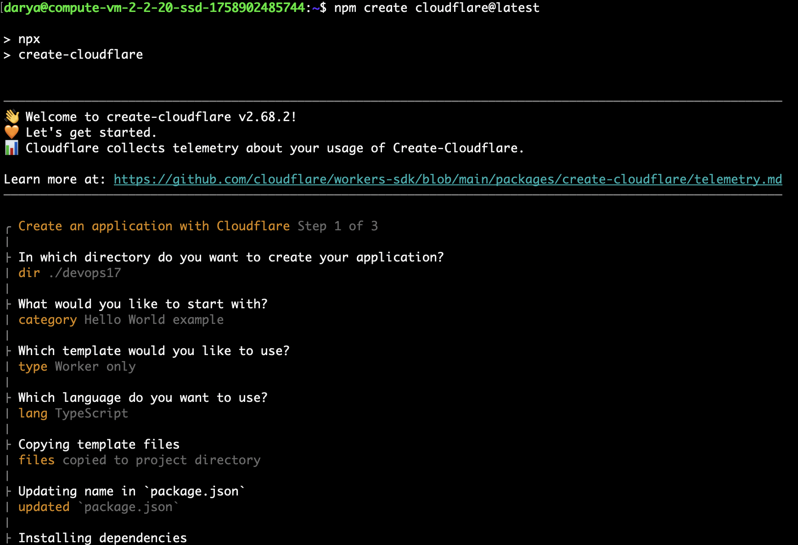

### Authentication

Wrangler authenticated via API Token (`npx wrangler whoami`):

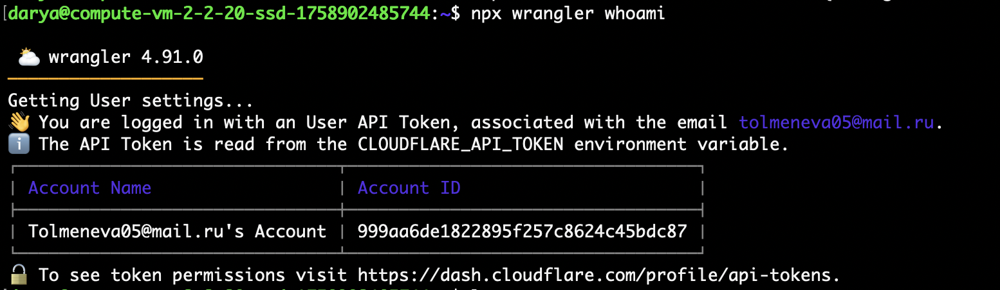

### Local Development

Running `npx wrangler dev` starts a local Miniflare server on port 8787. All routes tested locally:

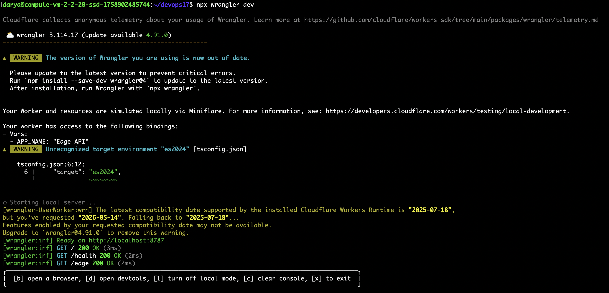

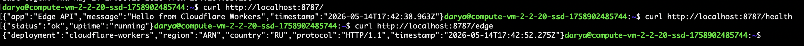

Each request is logged with `console.log("request", { path, method, colo, country })`, visible in local dev output and via `wrangler tail` in production:

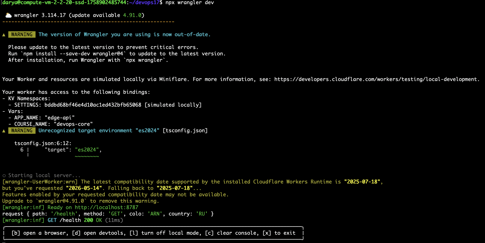

### Secrets and KV Setup

Secrets uploaded and KV namespace created:

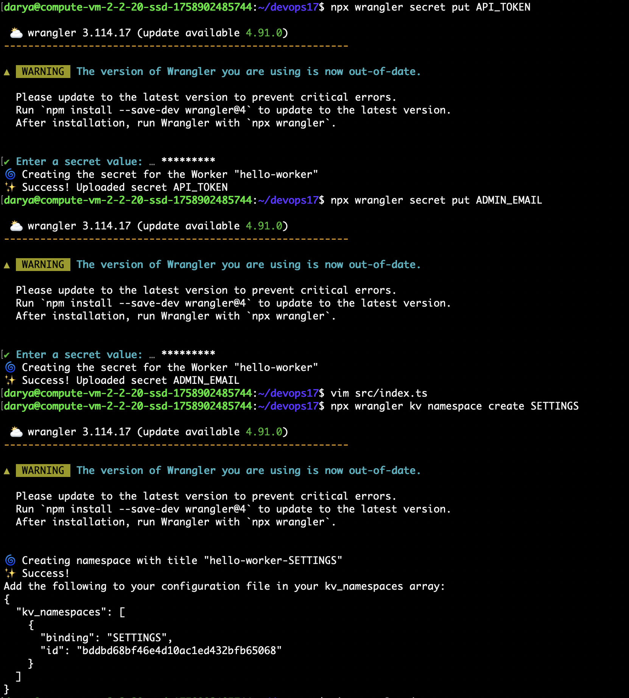

### Deployment

Deployed with `npx wrangler deploy`. The Worker uploads in under 1 second and is live globally:

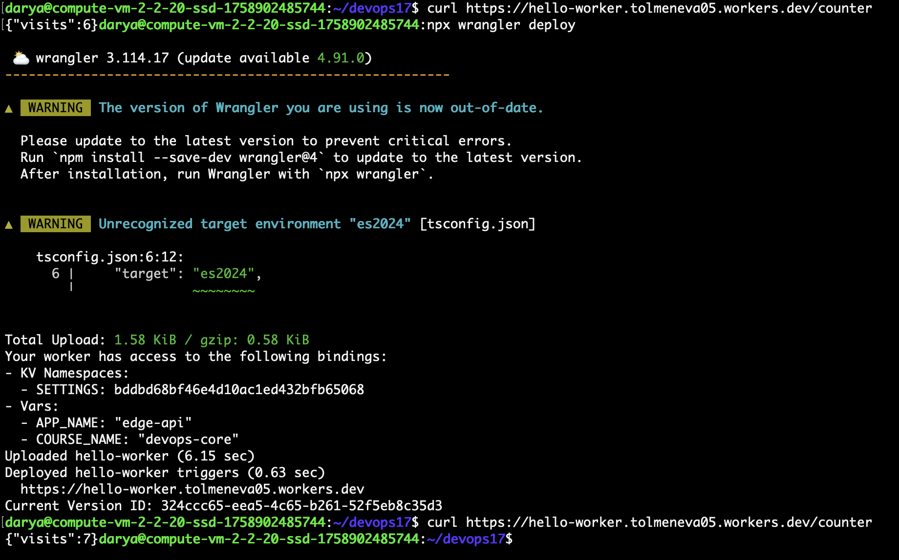

### Deployed Worker — /edge Response

`/edge` endpoint returns live Cloudflare metadata for the incoming request:

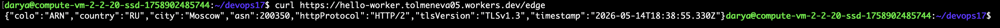

`ARN` is the Cloudflare Point of Presence in Stockholm — the nearest PoP for requests from Russia. There was no explicit region selection; Cloudflare routed automatically.

### Deployed Worker — /config /secrets

Environment variables served from the deployed worker:

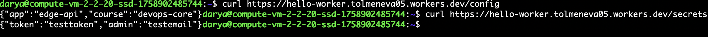

### Cloudflare Dashboard

Worker overview: 25 requests, 0 errors, avg CPU time 0.45 ms, KV namespace `SETTINGS` bound, Workers Logs enabled:

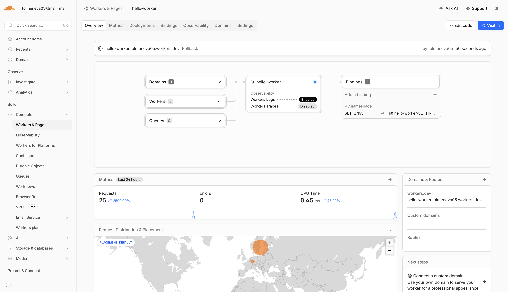

### Logs — wrangler tail

Real-time log streaming connected to the deployed worker:

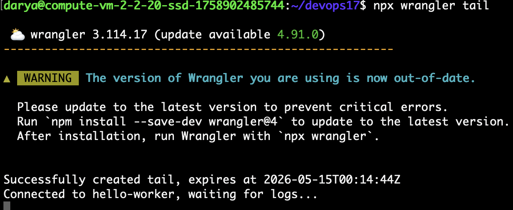

### KV Persistence After Redeploy

After redeployment the counter continued incrementing from its stored value — KV state survives deployments:

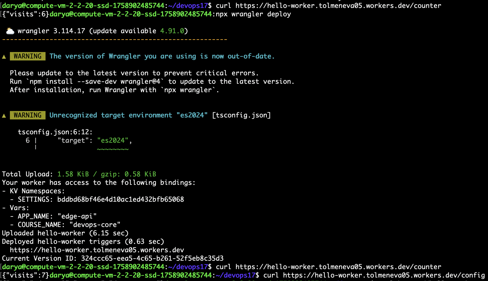

### Deployment History and Rollback

Deployment history showing multiple versions (secret changes, uploads):

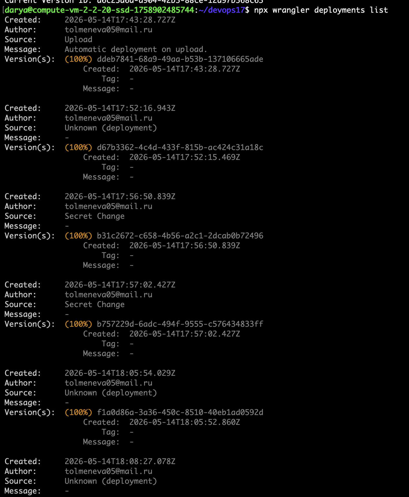

Rollback to a previous version executed with `npx wrangler rollback`:

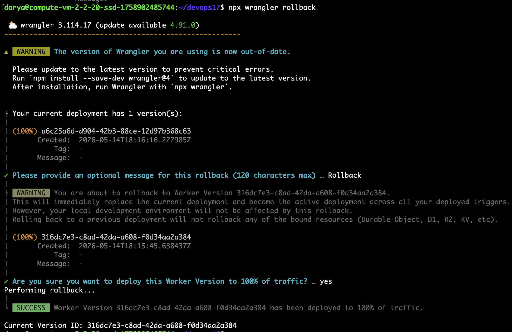

---

## 3. Kubernetes vs Cloudflare Workers Comparison

| Aspect                  | Kubernetes                                                    | Cloudflare Workers                                                    |
|-------------------------|---------------------------------------------------------------|-----------------------------------------------------------------------|
| **Setup complexity**    | High — cluster provisioning, node pools, manifests, ingress, TLS, registry | Low — one CLI command, one config file, no infra to manage            |
| **Deployment speed**    | Minutes — image build, push to registry, rollout, pod scheduling | Seconds — `wrangler deploy` propagates globally in < 1 min            |
| **Global distribution** | Manual — choose regions, replicate deployments, configure load balancing | Automatic — code runs in 300+ PoPs worldwide; no region selection     |
| **Cost (small apps)**   | High — you pay for idle nodes even at zero traffic            | Low — free tier covers 100 000 requests/day; pay only for usage       |
| **State / persistence** | Flexible — any database, persistent volumes, StatefulSets     | Limited — KV (eventually consistent), Durable Objects (strongly consistent), R2 for blobs; no traditional filesystem |
| **Control / flexibility** | Full — any language, any runtime, OS-level access, arbitrary processes | Limited — V8 isolates only, no OS access, CPU wall-clock < 30 ms by default, subset of Node.js APIs |
| **Best use case**       | Stateful services, long-running jobs, complex microservice meshes, ML inference, custom runtimes | Lightweight APIs, auth/routing at edge, request transformation, globally low-latency responses |

---

## 4. When to Use Each

**Kubernetes** — stateful workloads, long-running background jobs, custom runtimes or OS-level dependencies, complex microservice meshes, compliance requiring a fixed geographic region.

**Cloudflare Workers** — lightweight HTTP APIs, edge auth/rate limiting, globally low-latency responses, rapid prototyping without infra overhead.

**Recommendation:** for a simple global API without long-running state, Workers wins on every operational dimension. Switch to Kubernetes when the workload needs complex state, long execution time, or a runtime that V8 isolates can't provide.

---

## 5. Reflection

### What felt easier than Kubernetes?

Deployment: `npx wrangler deploy` replaces Dockerfile + registry + manifest + ingress + rollout. Global distribution is automatic — no "deploy to region X" step. `wrangler tail` gives production logs instantly without extra tooling.

### What felt more constrained?

No filesystem, no arbitrary OS access, CPU capped at ~30 ms. KV is eventually consistent — no transactions. Local dev via Miniflare mocks `request.cf`, so some edge behaviour only appears in production.

### What changed because Workers is not a Docker host?

The unit of deployment is a TypeScript module, not a container. There are no ports, no process model, no `process.env` — everything goes through the `Env` interface and Wrangler bindings. State must live in KV or Durable Objects, not memory or disk. The mental model shifts from a running server to a stateless function invoked per request.

