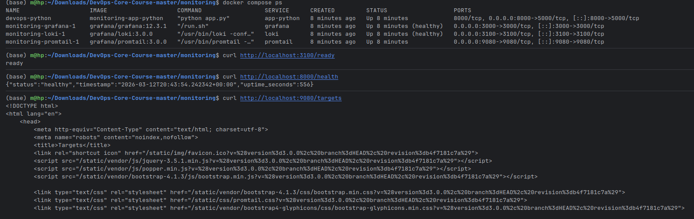
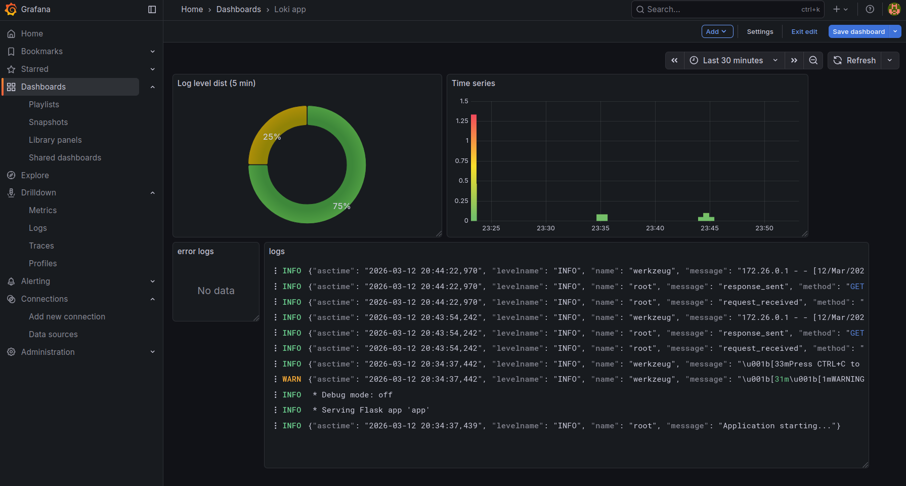
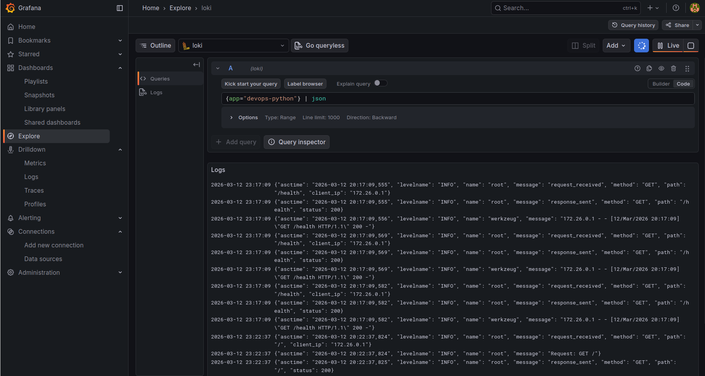
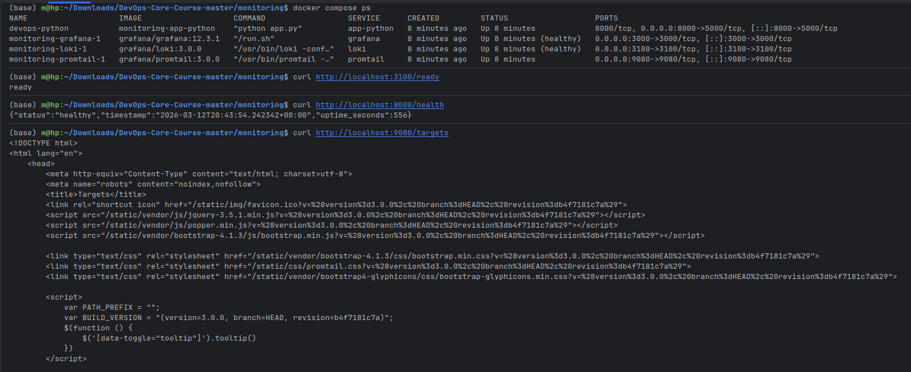
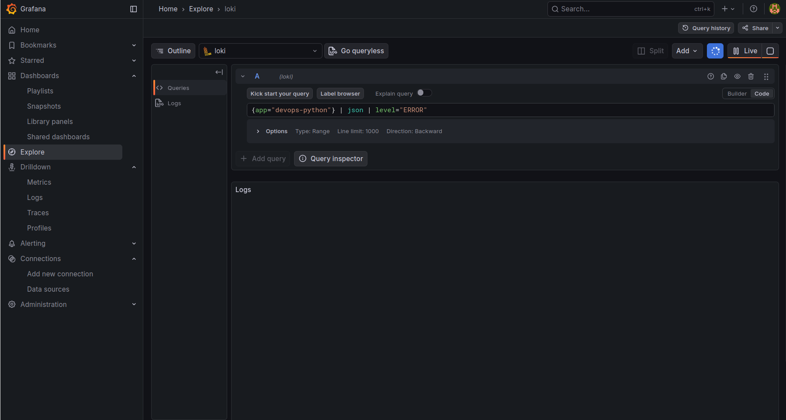

# LAB07 — Observability & Logging with Loki Stack

## 1. Architecture

Centralized logging stack using **Loki 3.0**, **Promtail 3.0**, **Grafana 12.3**, and the `devops-python` app.

* **Loki** — log storage (TSDB, retention 7 days)
* **Promtail** — collects container logs and forwards to Loki
* **Grafana** — visualizes logs and metrics

**Diagram:**

```
+-------------------+      Docker logs       +-------------------+
|   devops-python   |----------------------->|     Promtail      |
|   Flask App       |                        | Log Collector     |
+-------------------+                        +-------------------+
                                                       |
                                                       | Push logs (HTTP)
                                                       v
                                              +-------------------+
                                              |       Loki        |
                                              | TSDB log storage  |
                                              +-------------------+
                                                       |
                                                       | Queried by
                                                       v
                                              +-------------------+
                                              |     Grafana       |
                                              | Dashboards &      |
                                              | Visualization     |
                                              +-------------------+
```

---

## 2. Stack Deployment

**Docker Compose services:**

* `loki:3.0.0` — port 3100, TSDB storage
* `promtail:3.0.0` — port 9080, Docker SD, relabeling filters
* `grafana:12.3.1` — port 3000, healthcheck, admin credentials

**Healthchecks and resource limits added:**

```yaml
loki:
  healthcheck:
    test: [ "CMD", "wget", "-qO-", "http://localhost:3100/ready" ]
    interval: 10s
    retries: 5
  restart: unless-stopped

app-python:
  deploy:
    resources:
      limits:
        cpus: "0.50"
        memory: 256M
  restart: unless-stopped
```

**Verification:**

```bash
docker compose up -d
docker compose ps
curl http://localhost:3100/ready
curl http://localhost:8000/health
curl http://localhost:9080/targets
open http://localhost:3000
```





---

## 3. Application Logging

Python Flask app (`app-python`) configured with **JSON structured logging**:

```python
    import logging
from pythonjsonlogger import jsonlogger

logger = logging.getLogger()
handler = logging.StreamHandler()
formatter = jsonlogger.JsonFormatter('%(asctime)s %(levelname)s %(message)s %(name)s')
handler.setFormatter(formatter)
logger.addHandler(handler)
logger.setLevel(logging.INFO)

logger.info("Application starting", extra={"app": "devops-python"})
```

Logs include:

* request method, path, client IP
* app startup events
* error messages

**Sample Log in Grafana Explore:**

```logql
    {app="devops-python"} | json
```



---

## 4. Dashboard

Created **4 panels** in Grafana:

1. **logs** — recent logs from all apps, query: `{app=~"devops-.*"}`
2. **Time series** — logs per second by app, query: `sum by (app) (rate({app=~"devops-.*"}[1m]))`
3. **error logs** — only `ERROR` level, query: `{app=~"devops-.*"} | json | level="ERROR"`
4. **Log level dis (5 min)** — count logs by level, query:
   `sum by (level) (count_over_time({app=~"devops-.*"} | json [5m]))`


---

## 5. Production Readiness

* Added **resource limits** to all services
* Added **healthchecks**
* Enabled **restart policy: unless-stopped**
* Secured Grafana: disabled anonymous access, set admin credentials

**Verification:**

```bash
    docker compose ps
    curl http://localhost:3100/ready
    curl http://localhost:8000/health
    curl http://localhost:9080/targets
```



---

## 6. Testing

Generate traffic to Python app:

```bash
    for i in {1..20}; do curl http://localhost:8000/; done
    for i in {1..20}; do curl http://localhost:8000/health; done
```

Query logs in Grafana Explore:

```logql
    {app="devops-python"} | json
```


```logql
    {app="devops-python"} | json | level="ERROR"
```



---

## 7. Challenges

- Filtering unwanted containers:
  I needed to add filtering for the lab=lab07 label in Promtail to prevent other Docker containers from being included
  in Loki.

- JSON structured logging:
  Standard logging produced text that was difficult to parse in Grafana. I had to implement python-json-logger and
  configure formatting with the required fields for LogQL.
