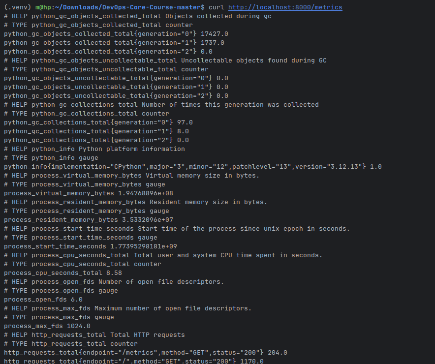
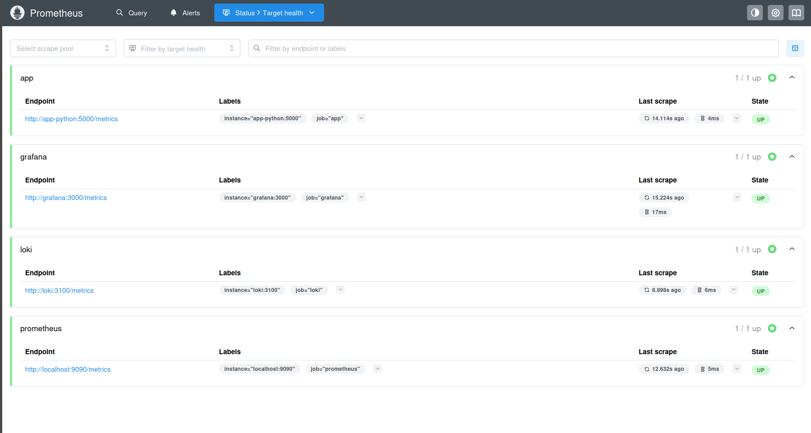
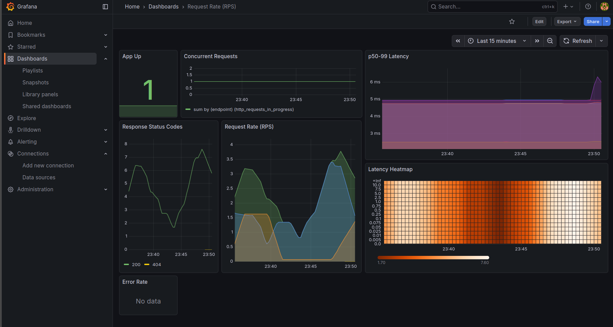
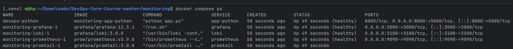
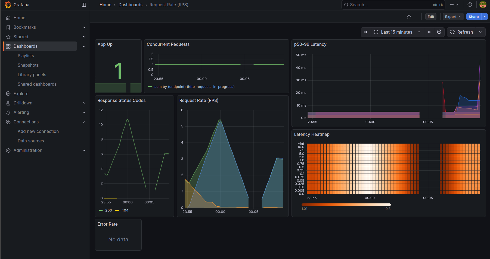
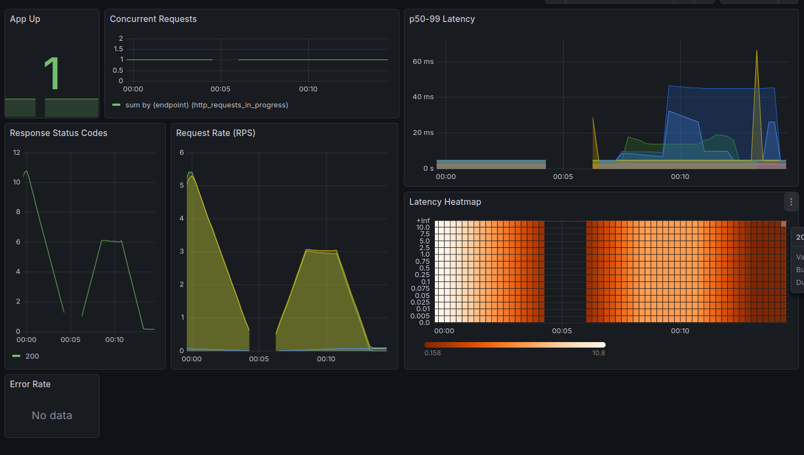
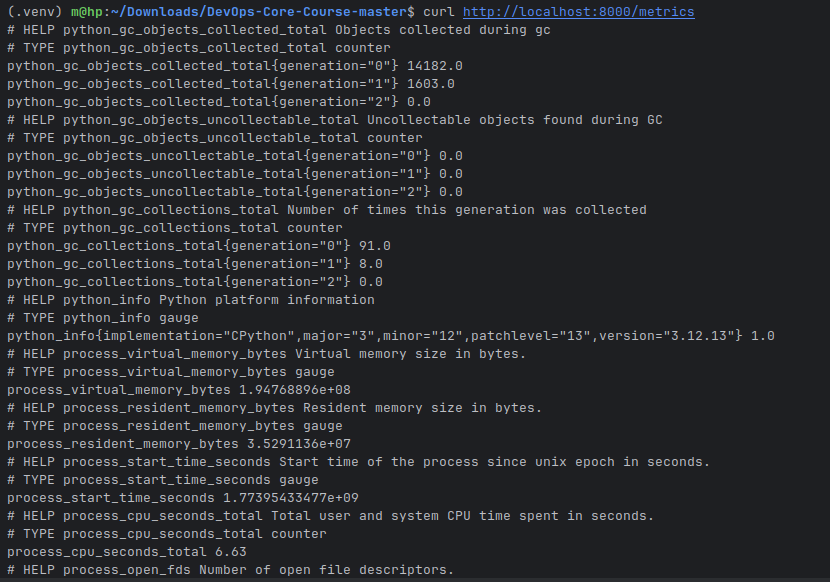

# Lab 8 — Metrics & Monitoring with Prometheus

## 1. Architecture Overview

The monitoring stack consists of:
- Application (Python/Flask) → exposes Prometheus metrics at `/metrics`
- Prometheus → scrapes metrics from app, itself, Loki, Grafana
- Grafana → visualizes metrics with custom dashboard
- Loki + Promtail → logs (from Lab 7, integrated)

**Metric flow:**  
App → Prometheus (pull) → Grafana (query with PromQL)
```
+-------------------+      /metrics endpoint      +-------------------+
|   devops-python   |---------------------------->|    Prometheus     |
|   Flask App       |   (scraped every 15s)       | Time Series DB    |
|                   |                             | (pull model)      |
+-------------------+                             +-------------------+
|                                                |
| HTTP scrape (job: "app")                       | PromQL queries
|                                                v
|                                     +-------------------+
+------------------------------------>|      Grafana      |
| Dashboards        |                 +-------------------+
| (RED metrics)     |
+-------------------+
```
Logs path (Lab 7):

```
+-------------------+      Docker logs       +-------------------+
|   devops-python   |----------------------->|     Promtail      |
|   Flask App       |                        | Log Collector     |
+-------------------+                        +-------------------+
                                                       |
                                                       | Push logs (HTTP)
                                                       v
                                              +-------------------+
                                              |       Loki        |
                                              | TSDB log storage  |
                                              +-------------------+
                                                       |
                                                       | Queried by
                                                       v
                                              +-------------------+
                                              |     Grafana       |
                                              | Dashboards &      |
                                              | Visualization     |
                                              +-------------------+
```

## 2. Application Instrumentation

I added Prometheus metrics using `prometheus-client` library.

**Installed:**  
`prometheus-client==0.23.1`

**Metrics implemented:**

- Counter: `http_requests_total` (labels: method, endpoint, status)
- Histogram: `http_request_duration_seconds` (labels: method, endpoint)
- Gauge: `http_requests_in_progress`

All requests are instrumented using `@app.before_request` and `@app.after_request`.

**Metrics endpoint:**  
`/metrics` returns text in Prometheus exposition format via `generate_latest()`

**Why these metrics?**  
They cover the RED method:  
- Rate → from `http_requests_total`  
- Errors → from `status=~"5.."`  
- Duration → from histogram (p50, p95, etc.)



## 3. Prometheus Configuration

**File:** `prometheus/prometheus.yml`

Main scrape jobs:
- prometheus (self)
- app (target: app-python:5000, path: /metrics)
- loki (loki:3100)
- grafana (grafana:3000)

Scrape interval: 15s  
Retention: 15 days or 10 GB



## 4. Grafana Dashboards

**Data source:** Prometheus at `http://prometheus:9090`

**Custom dashboard:** "DevOps App RED Metrics"

Panels (7 panels):
1. Request Rate (RPS) – `sum by (endpoint) (rate(http_requests_total[5m]))`
2. Error Rate – `sum(rate(http_requests_total{status=~"5.."}[5m])) or vector(0)`
3. p50–p99 Latency – `histogram_quantile(0.XX, sum by (le, endpoint) (rate(http_request_duration_seconds_bucket[5m])))`
4. Latency Heatmap – `sum by (le) (rate(http_request_duration_seconds_bucket[5m]))`
5. Concurrent Requests – `sum by (endpoint) (http_requests_in_progress)`
6. Response Status Codes (Pie) – `sum by (status) (rate(http_requests_total[5m]))`
7. App Up – `up{job="app"}`



**PromQL examples used:**
- Rate: `sum by (endpoint) (rate(http_requests_total[5m]))`
- Errors %: `(sum(rate(http_requests_total{status=~"5.."}[5m])) / sum(rate(http_requests_total[5m])) * 100) or vector(0)`
- p95 Latency: `histogram_quantile(0.95, sum by (le) (rate(http_request_duration_seconds_bucket[5m])))`

## 5. Production Setup

**Health checks:**
- Prometheus: `wget ... /-/healthy`
- Grafana: `wget ... /api/health`
- Loki: `wget ... /ready`
- App: `curl -f http://localhost:5000/health`

**Resource limits:**
- Prometheus: 1 CPU / 1 GB
- Loki: 1 CPU / 1 GB
- Grafana: 0.5 CPU / 512 MB
- App-python: 0.5 CPU / 256 MB

**Retention & Persistence:**
- Prometheus: 15 days or 10 GB
- Data stored in named volumes (`prometheus-data`, `grafana-data`, `loki-data`)
- Tested: after `docker compose down && up -d` – dashboards and data remain



Proof of percistanse:


## 6. Testing Results & Observations

- All targets in Prometheus UP
- Metrics collected from application (not only /metrics, but / and /health too)
- Dashboard shows real RED metrics under load
- No 5xx errors observed → Error Rate = 0 (expected)
- Latency ~4–7 ms under normal conditions and 45 ms under stable curling with sleep 0.11 s





## 7. Challenges & Solutions

- Problem: p95 latency showed "No data"  
  Solution: Generated more traffic on / and /health (not only /metrics), checked that duration is in seconds

- Problem: Error Rate panel empty  
  Solution: No real errors → added `or vector(0)` to show 0 explicitly

- Problem: Low RPS on graphs  
  Solution: Used curl loop to simulate load → RPS increased to 2–3+

Everything works as expected now.

**Total:** Core tasks completed (Tasks 1–5).  
Bonus (Ansible) – not implemented in this report.
